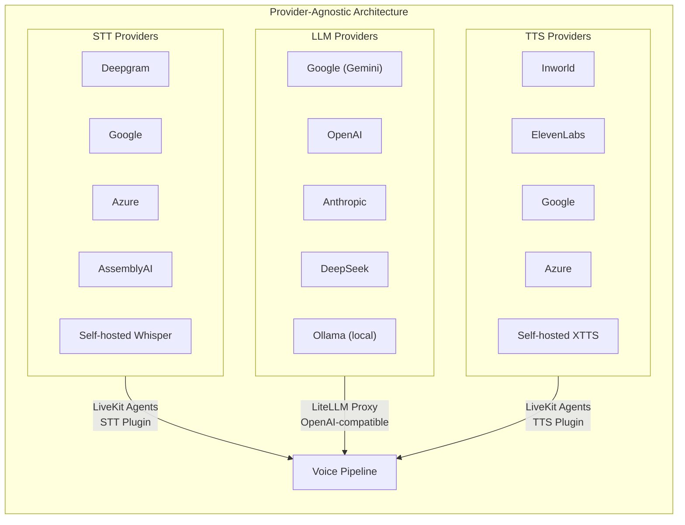
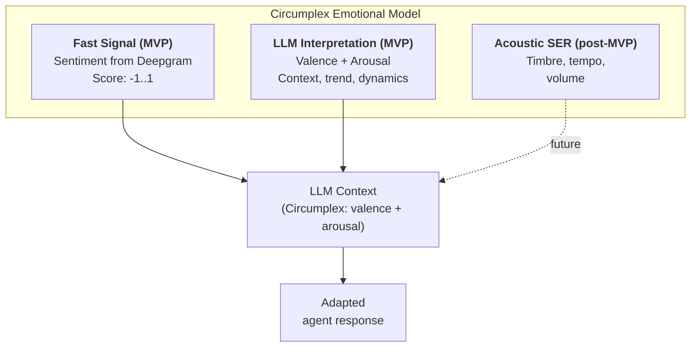

# Voice AI Agent: Product Description

**Version:** 2.0 — MVP
**Date:** March 2026

> Description of the idea, key principles, and product concepts. Technical architecture — in [architecture.md](architecture.md), stack specifications — in [specs.md](specs.md).

---

## 1. Product Idea

### What It Is

An interactive AI agent specializing in a specific expert topic — medicine, psychology, nutrition, or any other domain. The agent possesses the knowledge of a specific specialist, loaded from books, articles, podcasts, and other materials, and conducts a meaningful dialogue with the user — primarily by voice, but also by text.

### How the User Interacts with the Agent

The user opens a PWA application in the browser. They see an interface combining voice and text chat. Within a single session, the user freely switches between modes: they can start a conversation by voice, then switch to text, and back. The conversation context is fully preserved — the agent remembers everything said in both modes. Voice message transcripts are displayed in the text chat, forming a single, continuous dialogue history.

### Two-Layer Response Delivery

The agent generates a response in two formats simultaneously:

**By voice** — a brief, conversational answer of 2–5 phrases. Clarifying questions, key points, next steps. The voice response is optimized for auditory perception: no lists, links, or lengthy enumerations.

**In the text chat** — the same points in a structured format. Each point is accompanied by a source indicator icon (book, video, post, podcast). Clicking the icon opens a popup with detailed information about all sources supporting the given point: author, title, specific section/chapter, page or timestamp, direct link to the material (if available). A single point may reference multiple sources if the LLM synthesized the answer from several knowledge base fragments.

This approach strengthens trust in the agent and differentiates the product from a typical voice bot — the user receives not only an answer but also a verifiable evidence base with precision down to a specific source fragment.

### Emotional Adaptation

The agent adapts its communication style to the user's emotional state. Emotional assessment is based on the two-dimensional Circumplex model (valence — positivity/negativity, arousal — degree of activation). This allows distinguishing fundamentally different states: a panic attack (negative + high arousal) from apathy (negative + low arousal) — and adapting tone, degree of empathy, and nature of recommendations accordingly.

### Proactive Behavior

The agent is not limited to reactive responses. During a prolonged pause after its response, the agent may gently initiate continuation of the dialogue: ask a clarifying question, suggest developing the topic, or ask if the user needs time to think. This makes the interaction more natural and closer to a live conversation with a specialist.

### Crisis Protocol

Upon detecting alarming signals (mention of suicidal thoughts, acute crisis, dangerous symptoms), the agent switches to a fixed response protocol: expresses empathy, does not dismiss the condition, recommends seeking professional help, and provides contact information for support services. Service contacts are determined dynamically based on the user's language/locale and stored in the database, not hardcoded in prompts or code. The agent does not diagnose, prescribe treatment, or substitute for a doctor.

### MVP Boundaries

- One agent with one expert topic
- Up to 30 concurrent user sessions
- Each user conducts an independent conversation with the agent
- Beyond MVP: multi-agent routing, SIP telephony, horizontal scaling across multiple servers

### Language Support

At launch, the agent supports English and Russian. The architecture does not fundamentally restrict the set of languages — adding a new language depends solely on support for that language by the STT, TTS, and LLM providers in use. There are no hardcoded languages in the system: not in the pipeline, not in the prompts, not in the configuration.

---

## 2. Key Principles

### Provider Agnosticism

The central architectural principle is **maximum simplicity in replacing and adding providers** for three key components: speech recognition (STT), language model (LLM), and speech synthesis (TTS).

Each component interacts with the system through a standardized interface. The agent's business logic is not tied to a specific provider. Replacing a provider means changing configuration, typically without code changes.

**Practical caveat.** Providers differ in details: STT — in partial/final formats, punctuation; TTS — in emotion control, audio chunking; LLM — in response length, safety policies. Therefore, for MVP a "golden profile" of providers is established (Deepgram + Gemini Flash-Lite + Inworld), against which the UX is tested. Switching a provider is a supported scenario but requires UX verification. A practical guide to replacement is in [architecture.md](architecture.md).

### Database-Driven Configuration

All prompts, agent settings, and TTS parameters are stored in PostgreSQL, not in code:

- **Agent cloning** — creating a new agent comes down to copying database records and deploying the same Docker Compose with a different database. The code is shared across all agents.
- **Hot updates** — changing prompts or settings does not require rebuilding the container. Changes apply only to new sessions.
- **Versioning** — change history is stored in the database with rollback capability.

**Config snapshot per session.** At session start, the agent captures the current configuration version (prompts, TTS parameters, RAG settings). This exact version is used throughout the entire session — even if an administrator updated the configuration. This prevents the agent from "changing personality" mid-dialogue.

### Containerization

The entire project runs exclusively from Docker Compose. Each component is a separate container. Local development, testing, and production — all through Docker. Container composition and configuration are described in [architecture.md](architecture.md).

### Streaming at Every Stage

All voice pipeline components operate in streaming mode. STT delivers words as they are spoken. LLM streams tokens. TTS begins synthesis before the full response is generated. This minimizes perceived latency and creates the impression of a live conversation.

---

## 3. Technology Stack

> Minimum versions and dependencies — in [specs.md](specs.md). Integration details and interaction diagrams — in [architecture.md](architecture.md).

### LiveKit Agents — Voice Pipeline Core

An open-source Python framework for real-time voice AI agents. The agent operates as a participant in a LiveKit room, exchanging audio and data via WebRTC. Chosen for: SFU transport (stable connection through NAT), built-in Agent Server (job isolation, graceful shutdown, load balancing), plugin system for STT/LLM/TTS providers, built-in VAD (Silero) and turn detector.

### Deepgram Nova-3 — Speech Recognition (STT)

Streaming recognition with ~300 ms latency to the first word. Support for 45+ languages, including Russian and English. Additionally provides sentiment analysis (-1..1) for each segment with no additional latency — used as a fast signal for the emotional model.

### Inworld AI — Speech Synthesis (TTS)

First place on Artificial Analysis TTS Arena. 15 languages, including Russian and English. Two models: TTS-1.5 Max (~200 ms, $10/1M characters) and TTS-1.5 Mini (~100 ms, $5/1M characters). Expressiveness and speed control, zero-shot voice cloning from 5–15 seconds of audio.

Alternative provider — **ElevenLabs** as a fallback or alternative for languages/voices where Inworld does not deliver the required quality.

### Google Gemini Flash-Lite + LiteLLM Proxy — Language Model

**Gemini 3.1 Flash-Lite** — the primary model, chosen for ultra-low generation latency. **GPT-4.1-mini** — fallback when the primary provider is unavailable.

**LiteLLM Proxy** — an OpenAI-compatible gateway between the agent and LLM providers. Unified interface, automatic fallback, cost tracking, rate limiting. The agent code calls LiteLLM at a single address and does not know which model is running behind the proxy.

### PostgreSQL + pgvector — Data and RAG

PostgreSQL — a unified store: agent configuration, session and message history, user profiles, emotional data, knowledge base with vector embeddings (via the pgvector extension). A single transactional model — metadata and vectors in one database, atomic operations, unified backup.

### FastAPI — REST API

HTTP endpoints for operations outside the real-time chat: authentication, LiveKit token generation, dialogue history, source metadata for attribution popups, administrative endpoints. Chat (voice and text) runs entirely through LiveKit.

### WebRTC via LiveKit SFU — Transport

LiveKit Server (self-hosted) — SFU media server. Signaling (HTTP/WebSocket) is proxied through Caddy with TLS termination. Media (audio/video over UDP) goes directly between the client and LiveKit, bypassing the HTTP proxy. TURN server (coturn) — fallback for clients behind strict NAT.

### PWA (React) — Client

A React application with two communication channels: **LiveKit Client SDK** for real-time chat in both modes (voice — WebRTC audio, text — data channel) and **FastAPI** (HTTP) for REST operations (authentication, history, sources). Voice and text chat in a unified interface. Switching between modes is instant — the client is always connected to the LiveKit room.

---

## 4. Knowledge Base and RAG

### Concept

Expert materials (books, articles, podcasts, interviews) undergo preprocessing: text extraction, semantic chunking by meaning blocks (not by a fixed number of tokens), metadata enrichment (author, title, section, page, timestamp), and embedding generation. The result is stored in PostgreSQL with an HNSW index for ANN search.

With each LLM request, relevant fragments are retrieved by semantic similarity to the query and included in the context — with metadata for forming references in the response. Hybrid search is used: vector (cosine distance, pgvector) + full-text (tsvector) + metadata filters.

### Source Attribution

Each point in the text response is accompanied by RAG fragment identifiers. The client displays indicator icons (book, video, podcast, article) with clickable popups: author, title, section, page/timestamp, link. In the voice response, the agent mentions the source verbally: "as Dr. Ivanov writes in his book..."

If the agent responds based on the model's general knowledge (without confirmation from the knowledge base), it explicitly marks this as reasoning, not an established fact.

### Language Specifics

Materials in the knowledge base may be in different languages. Language filtering prioritizes fragments in the same language but does not exclude cross-language results — if the embedding model is multilingual, a relevant fragment in one language may be useful for answering in another.

### GraphRAG (Post-MVP)

For topics where relationships between entities are critically important (disease → symptoms → contraindications → recommendations), GraphRAG is planned — an approach combining vector search with knowledge graphs. Implementation options: Microsoft GraphRAG, FalkorDB.

---

## 5. Emotional Adaptation

### Circumplex Model

Instead of a linear sentiment scale (-1..1), the system uses the two-dimensional psychological Circumplex model:

- **Valence:** positive ↔ negative emotion
- **Arousal:** passivity ↔ activity

This allows distinguishing states that are indistinguishable on a one-dimensional scale:

| State | Valence | Arousal | Agent Response |
|-------|---------|---------|----------------|
| Panic, anxiety | Negative | High | Calming tone, slowed pace, simple questions |
| Apathy, depression | Negative | Low | Gentle engagement, delicate questions, no pressure |
| Enthusiasm, joy | Positive | High | Energy support, concrete steps, topic development |
| Calm, satisfaction | Positive | Low | Professional tone, informative answers |

### Data Sources (MVP)

**Fast signal** — sentiment score from Deepgram (-1..1) for each transcript segment. Arrives with no additional latency as part of the STT result.

**LLM interpretation** — the LLM evaluates the user's state in the two-dimensional space (valence/arousal) based on text, sentiment score, context of previous utterances, and change dynamics (trend).

**Acoustic analysis (post-MVP)** — Speech Emotion Recognition based on acoustic voice characteristics (timbre, pitch, tempo, volume). Will enable detecting cases where the text is neutral but the voice reveals anxiety.

---

## 6. Prompt System

The prompt system consists of several layers, each solving a specific task. All prompts are stored in PostgreSQL (not in code) and loaded during agent initialization.

### Agent System Prompt

Defines the agent's role and specialization, sets the communication tone (empathetic, professional, not condescending), establishes competence boundaries (what the agent can and cannot discuss). Instructs on using RAG context: reference sources, do not fabricate facts. Defines behavior under uncertainty: acknowledge lack of knowledge, recommend consulting a real specialist.

### Voice Mode Adaptation Prompt

Instructs the LLM to generate conversational rather than written speech. Allow fillers, introductory words, soft pauses. Limit length for voice (2–5 short phrases) and provide detailed answers in text mode. Prohibits markdown, lists, and links in spoken speech.

### Two-Layer Response Prompt

Instructs the LLM to form a response in two parts:
- **Voice part** — brief points, conversational style. When mentioning a source — briefly aloud ("as Dr. Ivanov writes...").
- **Text part** — the same points structured, with RAG fragment identifiers for source icons in the client.

### Emotional Adaptation Prompt (Circumplex)

Instructs the LLM to evaluate the user's state in the two-dimensional space (valence/arousal), defines adaptation strategies for each quadrant, prohibits dismissing emotions, accounts for trend dynamics.

### Crisis Protocol Prompt

Fixed response rules for alarming signals: empathy, recommendation to consult a specialist, emergency service contacts. Highest priority — not overridden by dialogue context.

### RAG Context Prompt

Instructions for using knowledge base fragments. Priority: information from the knowledge base takes precedence over the model's general knowledge. Fabrication is prohibited. If the agent responds without confirmation from the knowledge base — it explicitly marks the response as reasoning, not fact.

### Language Adaptation Prompt

Instructs to respond in the user's language. Defines behavior when the language changes mid-dialogue. Sets terminology preferences when necessary.

### Proactive Utterance Prompt

Instructs to generate phrases for continuing the dialogue during a prolonged pause. Phrases account for context and emotional state. No more than once per pause.

### Dynamic Prompt Components

With each LLM request, the following are formed:
- Current emotional assessment (valence, arousal) and session trend
- RAG fragments with source metadata
- Information about the communication mode (voice/text) for format adaptation
- Proactive utterance flag (if the request was initiated by a silence timer)

---

## 7. Future Development (Post-MVP)

- **Horizontal scaling** — multiple Agent Servers with automatic load balancing
- **LiveKit clustering** — multiple nodes or migration to LiveKit Cloud
- **Self-hosted STT/TTS** — Faster-Whisper, XTTS v2 for cost reduction and privacy
- **Self-hosted LLM** — Ollama/vLLM via LiteLLM on GPU
- **Multi-agent architecture** — different agents for different specializations
- **GraphRAG** — knowledge graphs for chains like "disease → symptoms → recommendations"
- **LLM Observability** — Langfuse/Phoenix for tracing RAG, emotions, crisis triggers
- **Acoustic emotion analysis** — Speech Emotion Recognition based on voice characteristics
