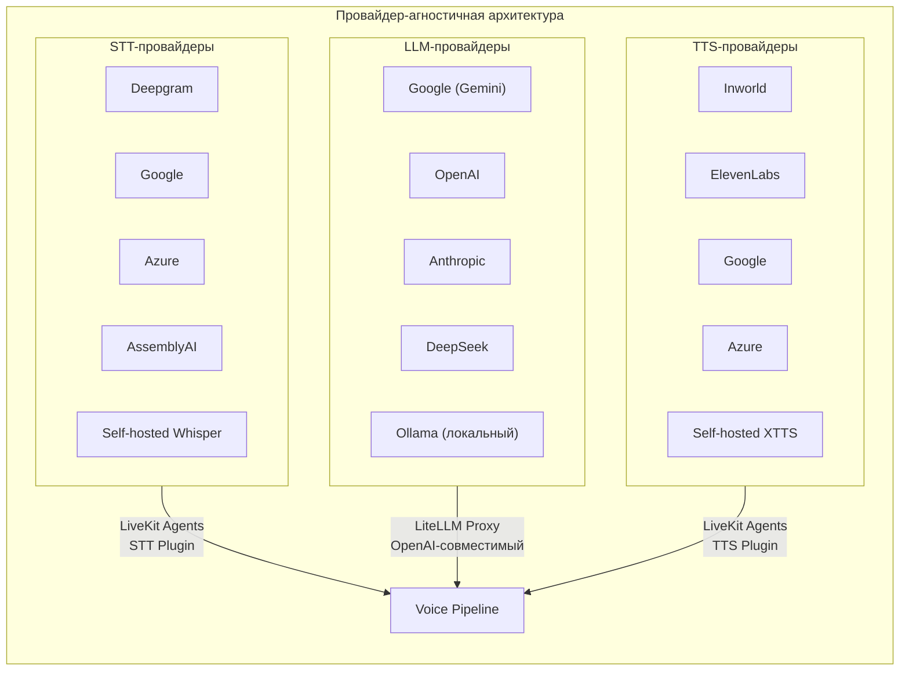
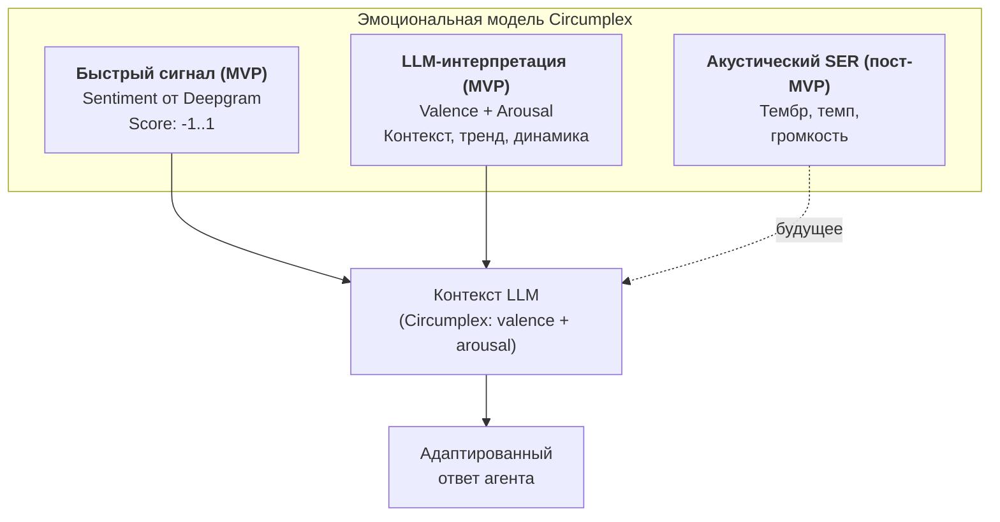

# Голосовой AI-агент: описание продукта

**Версия:** 2.0 — MVP
**Дата:** март 2026

> Описание идеи, ключевых принципов и концепций продукта. Техническая архитектура — в [architecture.md](architecture.md), спецификации стека — в [specs.md](specs.md).

---

## 1. Идея продукта

### Что это

Интерактивный AI-агент, специализирующийся на конкретной экспертной теме — медицине, психологии, нутрициологии или любой другой области. Агент владеет знаниями конкретного специалиста, загруженными из книг, статей, подкастов и прочих материалов, и ведёт с пользователем осмысленный диалог — преимущественно голосом, но также и текстом.

### Как пользователь взаимодействует с агентом

Пользователь открывает PWA-приложение в браузере. Перед ним — интерфейс, совмещающий голосовой и текстовый чат. В рамках одной сессии пользователь свободно переключается между режимами: может начать разговор голосом, затем перейти в текст, и обратно. Контекст беседы при этом полностью сохраняется — агент помнит всё, что было сказано в обоих режимах. Транскрипты голосовых реплик отображаются в текстовом чате, формируя единую, непрерывную историю диалога.

### Двухслойная подача ответа

Агент формирует ответ в двух форматах одновременно:

**Голосом** — краткий, разговорный ответ из 2–5 фраз. Вопросы-уточнения, ключевые тезисы, следующий шаг. Голосовой ответ оптимизирован под устное восприятие: без списков, ссылок и длинных перечислений.

**В текстовом чате** — те же тезисы в структурированном виде. Каждый тезис сопровождается иконкой-индикатором источника (книга, видео, пост, подкаст). По клику на иконку открывается попап с детальной информацией обо всех источниках, на которые опирается данный тезис: автор, название, конкретный раздел/глава, страница или таймкод, прямая ссылка на материал (при наличии). Один тезис может ссылаться на несколько источников, если LLM синтезировал ответ из нескольких фрагментов базы знаний.

Такой подход усиливает доверие к агенту и отличает продукт от обычного голосового бота — пользователь получает не только ответ, но и проверяемую доказательную базу с точностью до конкретного фрагмента источника.

### Эмоциональная адаптация

Агент адаптирует стиль общения к эмоциональному состоянию пользователя. Эмоциональная оценка основана на двумерной модели Circumplex (valence — позитивность/негативность, arousal — степень возбуждения). Это позволяет различать принципиально разные состояния: паническую атаку (негатив + высокое возбуждение) от апатии (негатив + низкое возбуждение) — и адаптировать тон, степень эмпатии и характер рекомендаций соответственно.

### Проактивное поведение

Агент не ограничивается реактивными ответами. При затянувшейся паузе после своего ответа агент может мягко инициировать продолжение диалога: задать уточняющий вопрос, предложить развить тему или спросить, нужно ли время на обдумывание. Это делает взаимодействие более естественным и приближенным к живому разговору со специалистом.

### Кризисный протокол

При обнаружении тревожных сигналов (упоминание суицидальных мыслей, острого кризиса, опасных симптомов) агент переключается на фиксированный протокол ответа: проявляет эмпатию, не обесценивает состояние, рекомендует обратиться за профессиональной помощью и предоставляет контактные данные служб поддержки. Контакты служб определяются динамически по языку/локали пользователя и хранятся в БД, а не хардкодятся в промптах или коде. Агент не ставит диагнозы, не назначает лечение и не подменяет врача.

### Границы MVP

- Один агент с одной экспертной темой
- До 30 одновременных пользовательских сессий
- Каждый пользователь ведёт независимую беседу с агентом
- За рамками MVP: мульти-агентная маршрутизация, SIP-телефония, горизонтальное масштабирование на несколько серверов

### Языковая поддержка

На старте агент поддерживает английский и русский языки. Архитектура принципиально не ограничивает набор языков — добавление нового языка зависит исключительно от поддержки этого языка используемыми STT, TTS и LLM-провайдерами. В системе нет хардкода языков: ни в pipeline, ни в промптах, ни в конфигурации.

---

## 2. Ключевые принципы

### Провайдер-агностичность

Центральный принцип архитектуры — **максимальная простота замены и добавления провайдеров** для трёх ключевых компонентов: распознавания речи (STT), языковой модели (LLM) и синтеза речи (TTS).

Каждый компонент взаимодействует с системой через стандартизированный интерфейс. Бизнес-логика агента не привязана к конкретному провайдеру. Замена провайдера — изменение конфигурации, как правило без изменений кода.

**Практическая оговорка.** Провайдеры различаются в деталях: STT — форматами partial/final, пунктуацией; TTS — управлением эмоцией, чанкингом аудио; LLM — длиной ответа, safety-политиками. Поэтому для MVP зафиксирован «золотой профиль» провайдеров (Deepgram + Gemini Flash-Lite + Inworld), под который тестируется UX. Смена провайдера — поддерживаемый сценарий, но требующий проверки UX. Практическое руководство по замене — в [architecture.md](architecture.md).

### Конфигурация через базу данных

Все промпты, настройки агента и параметры TTS хранятся в PostgreSQL, а не в коде:

- **Клонирование агентов** — создание нового агента сводится к копированию записей в БД и деплою того же Docker Compose с другой базой. Код един для всех агентов.
- **Горячее обновление** — изменение промптов или настроек не требует пересборки контейнера. Изменения применяются только к новым сессиям.
- **Версионирование** — история изменений хранится в БД с возможностью отката.

**Config snapshot на сессию.** При старте сессии агент фиксирует текущую версию конфигурации (промпты, параметры TTS, настройки RAG). На протяжении всей сессии используется именно эта версия — даже если администратор обновил конфигурацию. Это предотвращает «смену личности» агента посреди диалога.

### Контейнеризация

Весь проект запускается исключительно из Docker Compose. Каждый компонент — отдельный контейнер. Локальная разработка, тестирование и продакшн — всё через Docker. Состав и конфигурация контейнеров описаны в [architecture.md](architecture.md).

### Стриминг на каждом этапе

Все компоненты voice pipeline работают в стриминговом режиме. STT отдаёт слова по мере произнесения. LLM стримит токены. TTS начинает синтез до завершения генерации полного ответа. Это минимизирует ощущаемую задержку и создаёт впечатление живого разговора.

---

## 3. Технологический стек

> Минимальные версии и зависимости — в [specs.md](specs.md). Детали интеграции и схемы взаимодействия — в [architecture.md](architecture.md).

### LiveKit Agents — ядро voice pipeline

Open-source Python-фреймворк для голосовых AI-агентов реального времени. Агент работает как участник в LiveKit-комнате, обмениваясь аудио и данными через WebRTC. Выбран за: SFU-транспорт (стабильный коннект через NAT), встроенный Agent Server (job isolation, graceful shutdown, load balancing), плагинную систему для STT/LLM/TTS-провайдеров, встроенный VAD (Silero) и turn detector.

### Deepgram Nova-3 — распознавание речи (STT)

Стриминговое распознавание с задержкой ~300 мс до первого слова. Поддержка 45+ языков, включая русский и английский. Дополнительно предоставляет sentiment-анализ (-1..1) для каждого сегмента без дополнительной задержки — используется как быстрый сигнал для эмоциональной модели.

### Inworld AI — синтез речи (TTS)

Первое место на Artificial Analysis TTS Arena. 15 языков, включая русский и английский. Две модели: TTS-1.5 Max (~200 мс, $10/1M символов) и TTS-1.5 Mini (~100 мс, $5/1M символов). Контроль экспрессивности и скорости, zero-shot voice cloning из 5–15 секунд аудио.

Альтернативный провайдер — **ElevenLabs** как fallback или альтернатива для языков/голосов, где Inworld не обеспечивает нужного качества.

### Google Gemini Flash-Lite + LiteLLM Proxy — языковая модель

**Gemini 3.1 Flash-Lite** — основная модель, выбрана за сверхнизкую задержку генерации. **GPT-4.1-mini** — fallback при недоступности основного провайдера.

**LiteLLM Proxy** — OpenAI-совместимый шлюз между агентом и LLM-провайдерами. Единый интерфейс, автоматический fallback, трекинг расходов, rate limiting. Агентский код обращается к LiteLLM по единому адресу и не знает, какая модель работает за прокси.

### PostgreSQL + pgvector — данные и RAG

PostgreSQL — единое хранилище: конфигурация агента, история сессий и сообщений, профили пользователей, эмоциональные данные, база знаний с векторными эмбеддингами (через расширение pgvector). Единая транзакционная модель — метаданные и векторы в одной базе, атомарные операции, единый бэкап.

### FastAPI — REST API

HTTP-эндпоинты для операций вне real-time чата: аутентификация, генерация LiveKit-токенов, история диалогов, метаданные источников для попапов атрибуции, административные эндпоинты. Чат (голосовой и текстовый) целиком идёт через LiveKit.

### WebRTC через LiveKit SFU — транспорт

LiveKit Server (self-hosted) — SFU-медиасервер. Сигналинг (HTTP/WebSocket) проксируется через Caddy с TLS-терминацией. Медиа (аудио/видео по UDP) идёт напрямую между клиентом и LiveKit, минуя HTTP-прокси. TURN-сервер (coturn) — fallback для клиентов за жёстким NAT.

### PWA (React) — клиент

React-приложение с двумя каналами связи: **LiveKit Client SDK** для real-time чата в обоих режимах (голос — WebRTC-аудио, текст — data channel) и **FastAPI** (HTTP) для REST-операций (аутентификация, история, источники). Голосовой и текстовый чат в едином интерфейсе. Переключение между режимами мгновенное — клиент всегда подключён к LiveKit-комнате.

---

## 4. База знаний и RAG

### Концепция

Экспертные материалы (книги, статьи, подкасты, интервью) проходят предварительную обработку: извлечение текста, семантическое чанкирование по смысловым блокам (не по фиксированному количеству токенов), обогащение метаданными (автор, название, раздел, страница, таймкод) и генерация эмбеддингов. Результат хранится в PostgreSQL с HNSW-индексом для ANN-поиска.

При каждом обращении к LLM релевантные фрагменты извлекаются по семантической близости к запросу и включаются в контекст — с метаданными для формирования ссылок в ответе. Используется гибридный поиск: векторный (cosine distance, pgvector) + полнотекстовый (tsvector) + фильтры по метаданным.

### Атрибуция источников

Каждый тезис в текстовом ответе сопровождается идентификаторами RAG-фрагментов. Клиент отображает иконки-индикаторы (книга, видео, подкаст, статья) с кликабельными попапами: автор, название, раздел, страница/таймкод, ссылка. В голосовом ответе агент упоминает источник устно: «как пишет доктор Иванов в своей книге...».

Если агент отвечает на основе общих знаний модели (без подтверждения из базы знаний), он явно маркирует это как рассуждение, а не установленный факт.

### Языковая специфика

Материалы в базе знаний могут быть на разных языках. Фильтрация по языку приоритизирует фрагменты на том же языке, но не исключает кросс-языковые результаты — если embedding-модель мультиязычная, релевантный фрагмент на одном языке может быть полезен для ответа на другом.

### GraphRAG (пост-MVP)

Для тем, где критически важны связи между сущностями (болезнь → симптомы → противопоказания → рекомендации), планируется GraphRAG — подход, объединяющий векторный поиск с графами знаний. Варианты реализации: Microsoft GraphRAG, FalkorDB.

---

## 5. Эмоциональная адаптация

### Модель Circumplex

Вместо линейной шкалы sentiment (-1..1) система использует двумерную психологическую модель Circumplex:

- **Valence (Валентность):** позитивная ↔ негативная эмоция
- **Arousal (Возбуждение):** пассивность ↔ активность

Это позволяет различать состояния, неразличимые одномерной шкалой:

| Состояние | Valence | Arousal | Реакция агента |
|-----------|---------|---------|----------------|
| Паника, тревога | Негативная | Высокое | Успокаивающий тон, замедление темпа, простые вопросы |
| Апатия, подавленность | Негативная | Низкое | Мягкая вовлечённость, деликатные вопросы, без давления |
| Энтузиазм, радость | Позитивная | Высокое | Поддержка энергии, конкретные шаги, развитие темы |
| Спокойствие, удовлетворение | Позитивная | Низкое | Профессиональный тон, информативные ответы |

### Источники данных (MVP)

**Быстрый сигнал** — sentiment score от Deepgram (-1..1) для каждого сегмента транскрипта. Поступает без дополнительной задержки как часть STT-результата.

**LLM-интерпретация** — LLM оценивает состояние пользователя в двумерном пространстве (valence/arousal) на основе текста, sentiment score, контекста предыдущих реплик и динамики изменений (тренд).

**Акустический анализ (пост-MVP)** — Speech Emotion Recognition по акустическим характеристикам голоса (тембр, высота, темп, громкость). Позволит детектировать случаи, когда текст нейтрален, но голос выдаёт тревогу.

---

## 6. Система промптов

Промпт-система состоит из нескольких слоёв, каждый из которых решает конкретную задачу. Все промпты хранятся в PostgreSQL (не в коде) и загружаются при инициализации агента.

### Системный промпт агента

Определяет роль и специализацию агента, задаёт тон общения (эмпатичный, профессиональный, не менторский), устанавливает границы компетенции (о чём агент может говорить, о чём нет). Инструктирует по использованию RAG-контекста: ссылаться на источники, не выдумывать факты. Определяет поведение при неопределённости: признавать незнание, рекомендовать обратиться к реальному специалисту.

### Промпт адаптации к голосовому режиму

Инструктирует LLM генерировать разговорную, а не письменную речь. Допускать филлеры, вводные слова, мягкие паузы. Ограничивать длину для голоса (2–5 коротких фраз) и давать развёрнутые ответы в текстовом режиме. Запрещает markdown, списки, ссылки в устной речи.

### Промпт двухслойного ответа

Инструктирует LLM формировать ответ в двух частях:
- **Голосовая часть** — краткие тезисы, разговорный стиль. При упоминании источника — кратко вслух («как пишет доктор Иванов...»).
- **Текстовая часть** — те же тезисы структурированно, с идентификаторами RAG-фрагментов для иконок-источников в клиенте.

### Промпт эмоциональной адаптации (Circumplex)

Инструктирует LLM оценивать состояние пользователя в двумерном пространстве (valence/arousal), определяет стратегии адаптации для каждого квадранта, запрещает обесценивание эмоций, учитывает динамику тренда.

### Промпт кризисного протокола

Фиксированные правила реагирования на тревожные сигналы: эмпатия, рекомендация обратиться к специалисту, контакты экстренных служб. Высший приоритет — не переопределяется контекстом диалога.

### Промпт для RAG-контекста

Инструктирует по использованию фрагментов базы знаний. Приоритет: информация из базы выше общих знаний модели. Запрещает выдумывание. Если агент отвечает без подтверждения из базы знаний — явно маркирует как рассуждение, а не факт.

### Промпт языковой адаптации

Инструктирует отвечать на языке пользователя. Определяет поведение при смене языка в середине диалога. При необходимости задаёт терминологические предпочтения.

### Промпт проактивных реплик

Инструктирует генерировать фразы для продолжения диалога при затянувшейся паузе. Фразы учитывают контекст и эмоциональное состояние. Не чаще одного раза за паузу.

### Динамические компоненты промпта

При каждом запросе к LLM формируются:
- Текущая эмоциональная оценка (valence, arousal) и тренд сессии
- RAG-фрагменты с метаданными источников
- Информация о режиме общения (голос/текст) для адаптации формата
- Флаг проактивной реплики (если запрос инициирован таймером тишины)

---

## 7. Развитие (пост-MVP)

- **Горизонтальное масштабирование** — несколько Agent Server с автоматическим load balancing
- **Кластеризация LiveKit** — несколько нод или переход на LiveKit Cloud
- **Self-hosted STT/TTS** — Faster-Whisper, XTTS v2 для снижения стоимости и приватности
- **Self-hosted LLM** — Ollama/vLLM через LiteLLM на GPU
- **Мульти-агентная архитектура** — разные агенты для разных специализаций
- **GraphRAG** — графы знаний для цепочек «болезнь → симптомы → рекомендации»
- **LLM Observability** — Langfuse/Phoenix для трейсинга RAG, эмоций, кризисных срабатываний
- **Акустический анализ эмоций** — Speech Emotion Recognition по характеристикам голоса
