# Project Architecture

**Version:** 2.0 — MVP
**Date:** March 2026

> Technical system architecture: components, data flows, protocols. Product description — in [about.md](about.md), stack specifications — in [specs.md](specs.md).

---

## 1. System Architecture

### 1.1 High-Level Architecture

The system consists of seven Docker containers on a single VPS, interacting with a PWA client and external API providers.

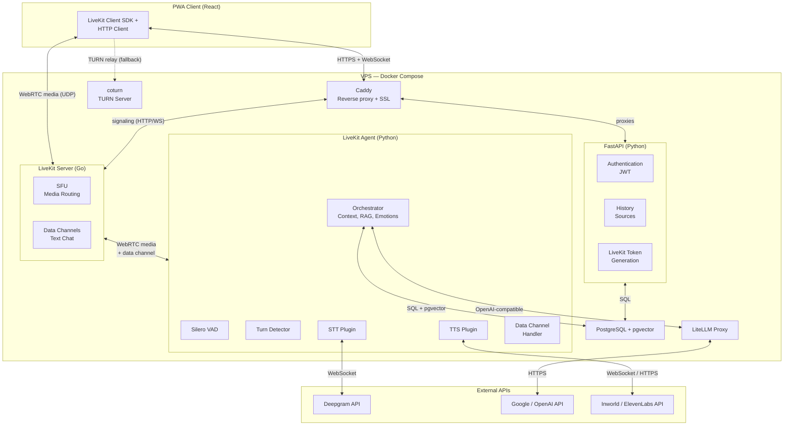
```mermaid
graph TB
    subgraph CLIENT["PWA Client (React)"]
        UI["LiveKit Client SDK +<br/>HTTP Client"]
    end

    subgraph VPS["VPS — Docker Compose"]
        CADDY["Caddy<br/>Reverse proxy + SSL"]

        subgraph API_SVC["FastAPI (Python)"]
            AUTH["Authentication<br/>JWT"]
            HISTORY["History<br/>Sources"]
            LK_TOKEN["LiveKit Token<br/>Generation"]
        end

        subgraph LIVEKIT_SVC["LiveKit Server (Go)"]
            SFU["SFU<br/>Media Routing"]
            DC["Data Channels<br/>Text Chat"]
        end

        COTURN["coturn<br/>TURN Server"]

        subgraph AGENT["LiveKit Agent (Python)"]
            VAD["Silero VAD"]
            TD["Turn Detector"]
            STT_P["STT Plugin"]
            ORCH["Orchestrator<br/>Context, RAG, Emotions"]
            TTS_P["TTS Plugin"]
            DC_HANDLER["Data Channel<br/>Handler"]
        end

        LITELLM["LiteLLM Proxy"]
        PG["PostgreSQL + pgvector"]
    end

    subgraph EXT["External APIs"]
        STT_API["Deepgram API"]
        LLM_API["Google / OpenAI API"]
        TTS_API["Inworld / ElevenLabs API"]
    end

    UI <-->|"HTTPS + WebSocket"| CADDY
    UI <-->|"WebRTC media (UDP)"| LIVEKIT_SVC
    CADDY <-->|"signaling (HTTP/WS)"| LIVEKIT_SVC
    CADDY <-->|"proxies"| API_SVC
    LIVEKIT_SVC <-->|"WebRTC media<br/>+ data channel"| AGENT
    UI -.->|"TURN relay (fallback)"| COTURN
    ORCH <-->|"SQL + pgvector"| PG
    ORCH <-->|"OpenAI-compatible"| LITELLM
    API_SVC <-->|"SQL"| PG
    STT_P <-->|"WebSocket"| STT_API
    LITELLM <-->|"HTTPS"| LLM_API
    TTS_P <-->|"WebSocket / HTTPS"| TTS_API
```

**Separation of signaling and media.** LiveKit uses two types of connections:

- **Signaling (HTTP/WebSocket)** — room management, authorization, ICE candidate exchange. Proxied through Caddy (port 443) with TLS termination.
- **Media (UDP)** — audio/video streams (RTP/RTCP). Go **directly** between the client and LiveKit Server over UDP, bypassing Caddy. LiveKit publishes a UDP port range (50000–60000) for direct ICE connections.

Caddy **does not proxy media traffic** — an HTTP reverse proxy cannot handle WebRTC UDP streams. The client receives ICE candidates through signaling and establishes a direct UDP connection to LiveKit.

TURN server (coturn) — a **fallback** for clients behind strict NAT (corporate networks, mobile carriers, Symmetric NAT). Direct UDP connection takes priority — TURN increases latency. All connections are encrypted (DTLS-SRTP).

**LiteLLM Proxy** is on the critical path of the voice pipeline — its unavailability means responses cannot be generated. Required: container health check, request timeouts on the agent side, proper handling of the "LLM unavailable" scenario (the agent informs the user about the issue rather than hanging). Depending on the startup mode, a LiteLLM container restart may be required to apply configuration changes.

### 1.2 Docker Compose Topology

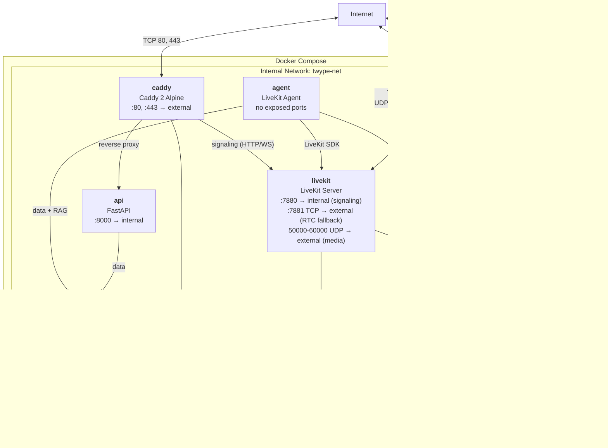
```mermaid
graph TB
    subgraph COMPOSE["Docker Compose"]
        direction TB

        subgraph NET["Internal Network: twype-net"]
            CADDY["<b>caddy</b><br/>Caddy 2 Alpine<br/>:80, :443 → external"]
            API["<b>api</b><br/>FastAPI<br/>:8000 → internal"]
            LIVEKIT["<b>livekit</b><br/>LiveKit Server<br/>:7880 → internal (signaling)<br/>:7881 TCP → external (RTC fallback)<br/>50000-60000 UDP → external (media)"]
            AGENT["<b>agent</b><br/>LiveKit Agent<br/>no exposed ports"]
            LITELLM["<b>litellm</b><br/>LiteLLM Proxy<br/>:4000 → internal"]
            PG["<b>postgres</b><br/>PostgreSQL 18<br/>:5432 → internal"]
            COTURN["<b>coturn</b><br/>TURN Server<br/>:3478, :5349 → external<br/>49152-65535 UDP → external"]
        end
    end

    subgraph VOL["Docker Volumes"]
        V_PG["pgdata"]
        V_CADDY["caddy-data<br/>caddy-config"]
        V_LK["livekit-config"]
        V_LLM["litellm-config"]
        V_TURN["coturn-config"]
    end

    PG --- V_PG
    CADDY --- V_CADDY
    LIVEKIT --- V_LK
    LITELLM --- V_LLM
    COTURN --- V_TURN

    CADDY -->|"signaling (HTTP/WS)"| LIVEKIT
    CADDY -->|"reverse proxy"| API
    AGENT -->|"LiveKit SDK"| LIVEKIT
    AGENT -->|"LLM requests"| LITELLM
    AGENT -->|"data + RAG"| PG
    API -->|"data"| PG
    LIVEKIT -->|"TURN relay"| COTURN

    INET["Internet"] <-->|"TCP 80, 443"| CADDY
    INET <-->|"TCP 7881<br/>UDP 50000-60000"| LIVEKIT
    INET <-->|"TCP/UDP 3478<br/>TCP 5349<br/>UDP 49152-65535"| COTURN
```

Container overview:

- **api** — FastAPI (Python). REST API: authentication, LiveKit token generation, dialog history, source metadata, administration. Connects to PostgreSQL. Proxied through Caddy. Depends on postgres.
- **agent** — LiveKit Agent (Python). Voice pipeline (VAD, Turn Detection, STT/TTS plugins), context processing, emotions, RAG. Custom Inworld TTS plugin (developed with the intent to submit a PR to the LiveKit Agents repository; used as a local module regardless of acceptance). Depends on livekit, litellm, postgres.
- **livekit** — LiveKit Server (Go). SFU media server: rooms, media stream routing, participant authorization. Lightweight (~50–100 MB RAM). Configured via YAML file (volume). Port 7880 (signaling) proxied through Caddy; ports 7881 TCP and 50000–60000 UDP — exposed directly.
- **coturn** — TURN server. Relays WebRTC traffic for clients behind strict NAT. A required component for stable connectivity in real-world network conditions.
- **litellm** — LiteLLM Proxy. OpenAI-compatible gateway to LLM providers. Configured via YAML file (volume).
- **postgres** — PostgreSQL 18 + pgvector. All application data and RAG embeddings. Persistence via Docker volume.
- **caddy** — Caddy 2 Alpine. Reverse proxy + automatic SSL (Let's Encrypt). Proxies HTTP/WS to LiveKit (signaling) and REST API to FastAPI. **Does not proxy WebRTC media.**

**Server requirements** (10–30 concurrent voice sessions):

| Resource | Requirement |
|----------|-------------|
| CPU | 4–8 cores |
| RAM | 8–16 GB |
| Disk | 50 GB SSD |
| OS | Ubuntu 22.04+ (any Linux with Docker) |

Each active agent session is a separate Python process (~100–200 MB RAM). The main load is network (WebRTC through SFU) and I/O (calls to external APIs).

### 1.3 Network Map

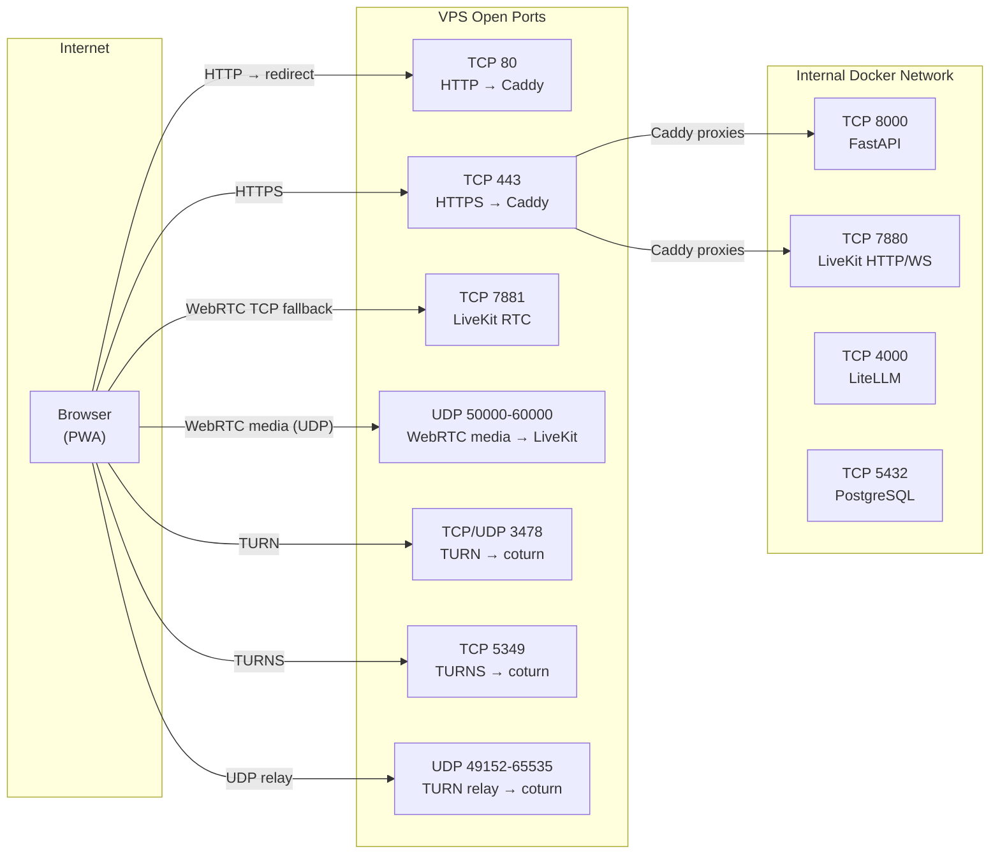
```mermaid
graph LR
    subgraph INTERNET["Internet"]
        BROWSER["Browser<br/>(PWA)"]
    end

    subgraph FIREWALL["VPS Open Ports"]
        P80["TCP 80<br/>HTTP → Caddy"]
        P443["TCP 443<br/>HTTPS → Caddy"]
        P7881["TCP 7881<br/>WebRTC TCP fallback → LiveKit"]
        PLKUDP["UDP 50000-60000<br/>WebRTC media → LiveKit"]
        P3478["TCP/UDP 3478<br/>TURN → coturn"]
        P5349["TCP 5349<br/>TURNS → coturn"]
        PUDP["UDP 49152-65535<br/>TURN relay → coturn"]
    end

    subgraph INTERNAL["Internal Docker Network"]
        P8000["TCP 8000<br/>FastAPI"]
        P7880["TCP 7880<br/>LiveKit HTTP/WS"]
        P7881["TCP 7881<br/>LiveKit RTC"]
        P4000["TCP 4000<br/>LiteLLM"]
        P5432["TCP 5432<br/>PostgreSQL"]
    end

    BROWSER -->|"HTTPS"| P443
    BROWSER -->|"HTTP → redirect"| P80
    BROWSER -->|"WebRTC media (UDP)"| PLKUDP
    BROWSER -->|"WebRTC TCP fallback"| P7881
    BROWSER -->|"TURN"| P3478
    BROWSER -->|"TURNS"| P5349
    BROWSER -->|"UDP relay"| PUDP

    P443 -->|"Caddy proxies"| P8000
    P443 -->|"Caddy proxies"| P7880
```

Network requirements summary:

| Port | Protocol | Purpose |
|------|----------|---------|
| 80 | TCP | HTTP → Caddy (redirect to HTTPS) |
| 443 | TCP | HTTPS → Caddy (API + LiveKit signaling) |
| 7880 | TCP | LiveKit API/WebSocket (internal, through Caddy) |
| 7881 | TCP | LiveKit WebRTC TCP fallback (public) |
| 50000–60000 | UDP | LiveKit WebRTC media RTP/RTCP (public) |
| 3478 | TCP/UDP | TURN (coturn) |
| 5349 | TCP | TURN over TLS (coturn) |
| 49152–65535 | UDP | TURN relay range (coturn) |

---

## 2. Monorepo Structure

### 2.1 Project Directories

```mermaid
graph TD
    ROOT["twype-voice/"]

    ROOT --> APPS["apps/"]
    ROOT --> PKGS["packages/"]
    ROOT --> DOCKER["docker/"]
    ROOT --> CONFIGS["configs/"]
    ROOT --> SCRIPTS["scripts/"]
    ROOT --> DOCS["docs/"]

    APPS --> API["api/<br/>FastAPI REST API"]
    APPS --> AGENT["agent/<br/>LiveKit Agent"]
    APPS --> WEB["web/<br/>React PWA"]

    API --> API_SRC["src/<br/>auth/ routes/ models/<br/>schemas/ services/ main.py"]
    API --> API_MIG["migrations/<br/>Alembic"]
    API --> API_TEST["tests/"]

    AGENT --> AG_SRC["src/<br/>plugins/ prompts/ rag/<br/>emotions/ main.py"]
    AGENT --> AG_TEST["tests/"]

    WEB --> WEB_SRC["src/<br/>components/ hooks/<br/>pages/ lib/ main.tsx"]
    WEB --> WEB_PUB["public/"]
    WEB --> WEB_TEST["tests/"]

    PKGS --> SHARED["shared/<br/>Shared Types"]

    DOCKER --> DF_API["Dockerfile.api"]
    DOCKER --> DF_AG["Dockerfile.agent"]
    DOCKER --> DF_WEB["Dockerfile.web"]
    DOCKER --> DC_PROD["docker-compose.yml"]
    DOCKER --> DC_DEV["docker-compose.dev.yml"]

    CONFIGS --> C_LK["livekit.yaml"]
    CONFIGS --> C_LLM["litellm.yaml"]
    CONFIGS --> C_CADDY["caddy/Caddyfile"]
    CONFIGS --> C_TURN["coturn/turnserver.conf"]

    SCRIPTS --> S_SEED["seed.py"]
    SCRIPTS --> S_INGEST["ingest.py"]
    SCRIPTS --> S_MIGRATE["migrate.sh"]
```

---

## 3. User Flows

### 3.1 Registration and Email Verification

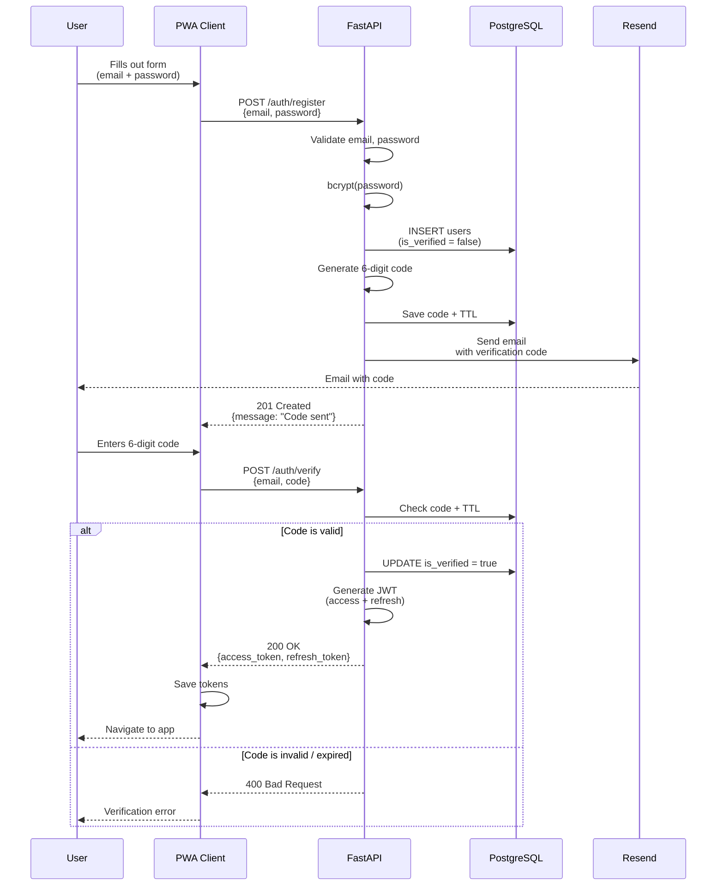
```mermaid
sequenceDiagram
    participant U as User
    participant PWA as PWA Client
    participant API as FastAPI
    participant DB as PostgreSQL
    participant R as Resend

    U->>PWA: Fills out form<br/>(email + password)
    PWA->>API: POST /auth/register<br/>{email, password}
    API->>API: Validate email, password
    API->>API: bcrypt(password)
    API->>DB: INSERT users<br/>(is_verified = false)
    API->>API: Generate 6-digit code
    API->>DB: Save code + TTL
    API->>R: Send email<br/>with verification code
    R-->>U: Email with code
    API-->>PWA: 201 Created<br/>{message: "Code sent"}

    U->>PWA: Enters 6-digit code
    PWA->>API: POST /auth/verify<br/>{email, code}
    API->>DB: Check code + TTL
    alt Code is valid
        API->>DB: UPDATE is_verified = true
        API->>API: Generate JWT<br/>(access + refresh)
        API-->>PWA: 200 OK<br/>{access_token, refresh_token}
        PWA->>PWA: Save tokens
        PWA-->>U: Navigate to app
    else Code is invalid / expired
        API-->>PWA: 400 Bad Request
        PWA-->>U: Verification error
    end
```

### 3.2 Login and Token Retrieval

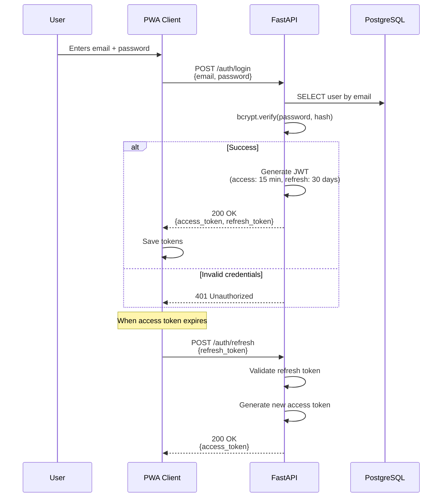
```mermaid
sequenceDiagram
    participant U as User
    participant PWA as PWA Client
    participant API as FastAPI
    participant DB as PostgreSQL

    U->>PWA: Enters email + password
    PWA->>API: POST /auth/login<br/>{email, password}
    API->>DB: SELECT user by email
    API->>API: bcrypt.verify(password, hash)

    alt Success
        API->>API: Generate JWT<br/>(access: 15 min, refresh: 30 days)
        API-->>PWA: 200 OK<br/>{access_token, refresh_token}
        PWA->>PWA: Save tokens
    else Invalid credentials
        API-->>PWA: 401 Unauthorized
    end

    Note over PWA: When access token expires
    PWA->>API: POST /auth/refresh<br/>{refresh_token}
    API->>API: Validate refresh token
    API->>API: Generate new access token
    API-->>PWA: 200 OK<br/>{access_token}
```

### 3.3 Starting a Voice Session

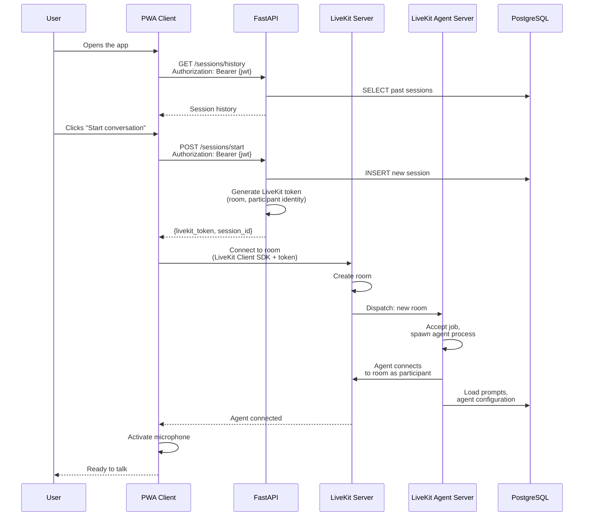
```mermaid
sequenceDiagram
    participant U as User
    participant PWA as PWA Client
    participant API as FastAPI
    participant LK as LiveKit Server
    participant AG as LiveKit Agent Server
    participant DB as PostgreSQL

    U->>PWA: Opens the app
    PWA->>API: GET /sessions/history<br/>Authorization: Bearer {jwt}
    API->>DB: SELECT past sessions
    API-->>PWA: Session history

    U->>PWA: Clicks "Start conversation"
    PWA->>API: POST /sessions/start<br/>Authorization: Bearer {jwt}
    API->>DB: INSERT new session
    API->>API: Generate LiveKit token<br/>(room, participant identity)
    API-->>PWA: {livekit_token, session_id}

    PWA->>LK: Connect to room<br/>(LiveKit Client SDK + token)
    LK->>LK: Create room
    LK->>AG: Dispatch: new room

    AG->>AG: Accept job,<br/>spawn agent process
    AG->>LK: Agent connects<br/>to room as participant
    AG->>DB: Load prompts,<br/>agent configuration

    LK-->>PWA: Agent connected
    PWA->>PWA: Activate microphone
    PWA-->>U: Ready to talk
```

### 3.4 Voice Dialog (Full Turn Cycle)

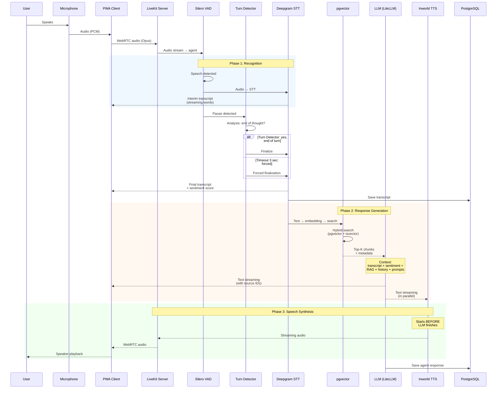
```mermaid
sequenceDiagram
    participant U as User
    participant MIC as Microphone
    participant PWA as PWA Client
    participant LK as LiveKit Server
    participant VAD as Silero VAD
    participant TD as Turn Detector
    participant STT as Deepgram STT
    participant RAG as pgvector
    participant LLM as LLM (LiteLLM)
    participant TTS as Inworld TTS
    participant DB as PostgreSQL

    U->>MIC: Speaks
    MIC->>PWA: Audio (PCM)
    PWA->>LK: WebRTC audio (Opus)
    LK->>VAD: Audio stream → agent

    rect rgb(240, 248, 255)
        Note over VAD,STT: Phase 1: Recognition
        VAD->>VAD: Speech detected
        VAD->>STT: Audio → STT
        STT-->>PWA: Interim transcript<br/>(streaming words)
    end

    VAD->>TD: Pause detected
    TD->>TD: Analysis: end of thought?

    alt Turn Detector: yes, end of turn
        TD->>STT: Finalize
    else Timeout 3 sec: forced
        TD->>STT: Forced finalization
    end

    STT-->>PWA: Final transcript<br/>+ sentiment score
    STT->>DB: Save transcript

    rect rgb(255, 248, 240)
        Note over RAG,LLM: Phase 2: Response Generation
        STT->>RAG: Text → embedding → search
        RAG->>RAG: Hybrid search<br/>(pgvector + tsvector)
        RAG-->>LLM: Top-K chunks<br/>+ metadata

        Note over LLM: Context:<br/>transcript + sentiment +<br/>RAG + history + prompts
        LLM-->>PWA: Text streaming<br/>(with source IDs)
        LLM-->>TTS: Text streaming<br/>(in parallel)
    end

    rect rgb(240, 255, 240)
        Note over TTS,LK: Phase 3: Speech Synthesis
        Note over TTS: Starts BEFORE<br/>LLM finishes
        TTS-->>LK: Streaming audio
        LK-->>PWA: WebRTC audio
        PWA-->>U: Speaker playback
    end

    LLM->>DB: Save agent response
```

### 3.5 Text Dialog

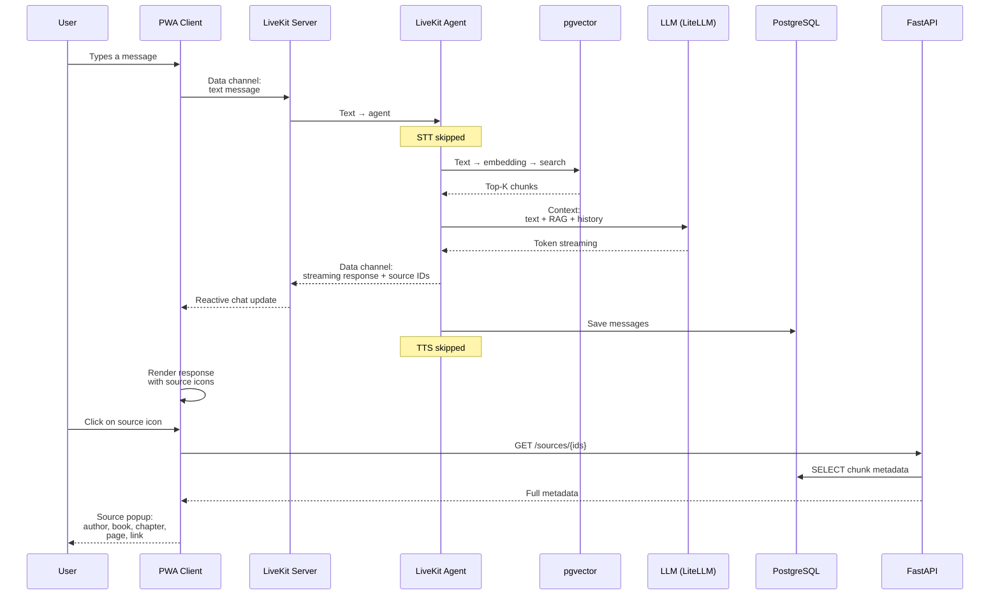
```mermaid
sequenceDiagram
    participant U as User
    participant PWA as PWA Client
    participant LK as LiveKit Server
    participant AG as LiveKit Agent
    participant RAG as pgvector
    participant LLM as LLM (LiteLLM)
    participant DB as PostgreSQL
    participant API as FastAPI

    U->>PWA: Types a message
    PWA->>LK: Data channel:<br/>text message
    LK->>AG: Text → agent

    Note over AG: STT skipped

    AG->>RAG: Text → embedding → search
    RAG-->>AG: Top-K chunks

    AG->>LLM: Context:<br/>text + RAG + history
    LLM-->>AG: Token streaming

    AG-->>LK: Data channel:<br/>streaming response + source IDs
    LK-->>PWA: Reactive chat update
    AG->>DB: Save messages

    Note over AG: TTS skipped

    PWA->>PWA: Render response<br/>with source icons

    U->>PWA: Click on source icon
    PWA->>API: GET /sources/{ids}
    API->>DB: SELECT chunk metadata
    API-->>PWA: Full metadata
    PWA-->>U: Source popup:<br/>author, book, chapter,<br/>page, link
```

### 3.6 Mode Switching: Voice ↔ Text

Both modes operate over a single real-time transport — LiveKit. Voice mode uses WebRTC audio tracks, text mode uses the data channel. Switching happens client-side: activating/deactivating audio tracks. The client is always connected to the room — switching is instant. A unified dialog history in PostgreSQL — the agent sees all messages from both modes.

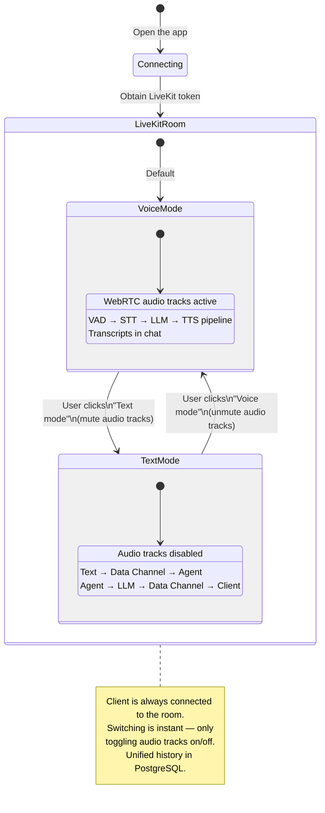
```mermaid
stateDiagram-v2
    [*] --> Connecting: Open the app
    Connecting --> LiveKitRoom: Obtain LiveKit token

    state LiveKitRoom {
        [*] --> VoiceMode: Default

        state VoiceMode {
            [*] --> AudioActive
            AudioActive: WebRTC audio tracks active
            AudioActive: VAD → STT → LLM → TTS pipeline
            AudioActive: Transcripts in chat
        }

        state TextMode {
            [*] --> DataChannel
            DataChannel: Audio tracks disabled
            DataChannel: Text → Data Channel → Agent
            DataChannel: Agent → LLM → Data Channel → Client
        }

        VoiceMode --> TextMode: User clicks\n"Text mode"\n(mute audio tracks)
        TextMode --> VoiceMode: User clicks\n"Voice mode"\n(unmute audio tracks)
    }

    note right of LiveKitRoom
        Client is always connected to the room.
        Switching is instant — only
        toggling audio tracks on/off.
        Unified history in PostgreSQL.
    end note
```

---

## 4. Voice Pipeline

### 4.1 Pipeline Components (Agent Internal Architecture)

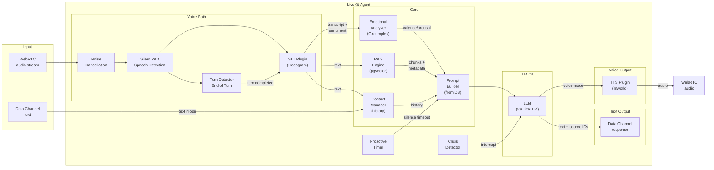
```mermaid
flowchart LR
    subgraph INPUT["Input"]
        AUDIO["WebRTC<br/>audio stream"]
        TEXT["Data Channel<br/>text"]
    end

    subgraph AGENT["LiveKit Agent"]
        subgraph VOICE_PATH["Voice Path"]
            VAD["Silero VAD<br/>Speech Detection"]
            NC["Noise<br/>Cancellation"]
            TD["Turn Detector<br/>End of Turn"]
            STT["STT Plugin<br/>(Deepgram)"]
        end

        subgraph CORE["Core"]
            EMO["Emotional<br/>Analyzer<br/>(Circumplex)"]
            CTX["Context<br/>Manager<br/>(history)"]
            RAG["RAG<br/>Engine<br/>(pgvector)"]
            PROMPT["Prompt<br/>Builder<br/>(from DB)"]
        end

        subgraph LLM_CALL["LLM Call"]
            LLM["LLM<br/>(via LiteLLM)"]
        end

        subgraph OUTPUT_VOICE["Voice Output"]
            TTS["TTS Plugin<br/>(Inworld)"]
        end

        subgraph OUTPUT_TEXT["Text Output"]
            DC_OUT["Data Channel<br/>response"]
        end

        PROACTIVE["Proactive<br/>Timer"]
        CRISIS["Crisis<br/>Detector"]
    end

    AUDIO --> NC --> VAD --> STT
    VAD --> TD
    TD -->|"turn completed"| STT
    TEXT -->|"text mode"| CTX

    STT -->|"transcript +<br/>sentiment"| EMO
    STT -->|"text"| RAG
    STT -->|"text"| CTX

    EMO -->|"valence/arousal"| PROMPT
    RAG -->|"chunks +<br/>metadata"| PROMPT
    CTX -->|"history"| PROMPT

    PROMPT --> LLM
    CRISIS -->|"intercept"| LLM

    LLM -->|"voice mode"| TTS
    LLM -->|"text + source IDs"| DC_OUT

    TTS -->|"audio"| OUTPUT_AUDIO["WebRTC<br/>audio"]

    PROACTIVE -->|"silence timeout"| PROMPT
```

**End-of-turn detection (Turn Detection).** Two-level approach:

- **Level 1 — Silero VAD.** Detects speech presence/absence in the audio stream. A fast detector that filters out silence and background noise. LiveKit Agents plugin (`livekit-agents[silero]`).
- **Level 2 — Turn Detector.** Activates on pause. Analyzes context: has the user finished their thought or just paused to think. Configurable timeout and confidence threshold parameters.

Fallback timeout: if the turn detector considers the user has not finished, but silence exceeds the threshold (default 3 seconds), the turn is forced to be considered complete. The threshold requires tuning — medical context implies longer pauses than customer service.

**Latency minimization.** Target voice-to-voice latency (from end of speech to start of response) — **~800 ms** with cloud STT/LLM/TTS. Techniques:

- **End-to-end streaming** — each component streams data to the next without waiting for completion. TTS begins synthesizing the first words while the LLM is still generating the rest.
- **Thinking sounds** — a subtle background sound during processing that reduces subjective perception of the pause.
- **TTS fillers** — for lengthy operations, the agent speaks a filler phrase: "One moment, let me check...", "Hmm, let me think...". Inserted automatically when the threshold is exceeded.
- **Prompt engineering** — the LLM uses conversational elements: short interjections ("so", "well then"), soft pauses. TTS renders them as natural speech elements.

### 4.2 Interruption Handling

The user can interrupt the agent at any time. When incoming speech is detected during a response, the current generation (LLM + TTS) is immediately cancelled, and the pipeline switches to receiving new input. LiveKit Agents supports this scenario natively (interruptions mechanism).

On false interruption (no words recognized after interruption within a timeout), the agent regenerates a brief continuation or repeats the last 1–2 sentences. Exact "resume from where it left off" is unreliable due to audio buffering.

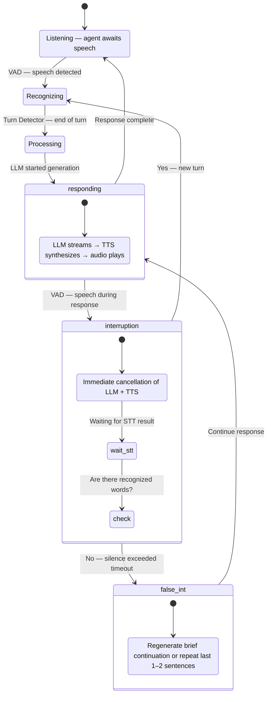
```mermaid
stateDiagram-v2
    [*] --> listening
    listening: Listening — agent awaits speech

    listening --> recognizing: VAD — speech detected
    recognizing: Recognizing
    recognizing --> processing: Turn Detector — end of turn
    processing: Processing
    processing --> responding: LLM started generation

    state responding {
        [*] --> llm_tts
        llm_tts: LLM streams → TTS synthesizes → audio plays
    }

    responding --> interruption: VAD — speech during response

    state interruption {
        [*] --> cancel
        cancel: Immediate cancellation of LLM + TTS
        cancel --> wait_stt: Waiting for STT result
        wait_stt --> check: Are there recognized words?
    }

    interruption --> recognizing: Yes — new turn
    interruption --> false_int: No — silence exceeded timeout

    state false_int {
        [*] --> regen
        regen: Regenerate brief continuation or repeat last 1–2 sentences
    }

    false_int --> responding: Continue response
    responding --> listening: Response complete
```

### 4.3 Proactive Utterances

After a response, a silence timer starts. If the user does not reply within the threshold (default 15–20 seconds), the agent initiates a follow-up:

- After a short pause: "Would you like me to explain in more detail?"
- After a long pause: "If you need time to think — that's okay. I'm here."
- After discussing a complex topic: "This is a tough topic. What concerns you the most?"

Specific phrases are generated by the LLM based on context, not hardcoded. The timer resets on any activity.

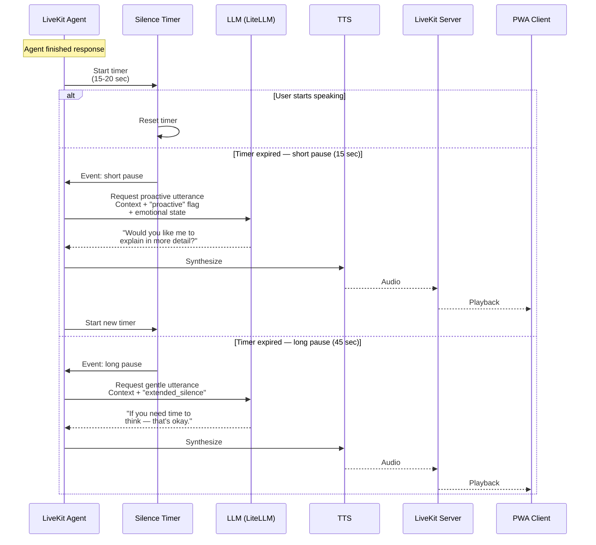
```mermaid
sequenceDiagram
    participant AG as LiveKit Agent
    participant TIMER as Silence Timer
    participant LLM as LLM (LiteLLM)
    participant TTS as TTS
    participant LK as LiveKit Server
    participant PWA as PWA Client

    Note over AG: Agent finished response

    AG->>TIMER: Start timer<br/>(15-20 sec)

    alt User starts speaking
        TIMER->>TIMER: Reset timer
    else Timer expired — short pause (15 sec)
        TIMER->>AG: Event: short pause
        AG->>LLM: Request proactive utterance<br/>Context + "proactive" flag<br/>+ emotional state
        LLM-->>AG: "Would you like me to<br/>explain in more detail?"
        AG->>TTS: Synthesize
        TTS-->>LK: Audio
        LK-->>PWA: Playback
        AG->>TIMER: Start new timer
    else Timer expired — long pause (45 sec)
        TIMER->>AG: Event: long pause
        AG->>LLM: Request gentle utterance<br/>Context + "extended_silence"
        LLM-->>AG: "If you need time to<br/>think — that's okay."
        AG->>TTS: Synthesize
        TTS-->>LK: Audio
        LK-->>PWA: Playback
    end
```

### 4.4 Crisis Protocol

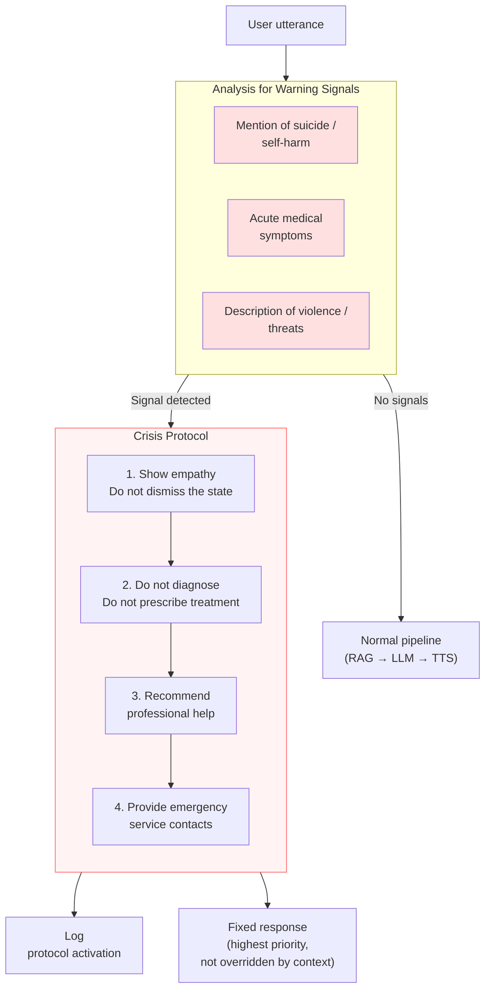
```mermaid
flowchart TD
    INPUT["User utterance"] --> ANALYSIS

    subgraph ANALYSIS["Analysis for Warning Signals"]
        CHECK1["Mention of suicide /<br/>self-harm"]
        CHECK2["Acute medical<br/>symptoms"]
        CHECK3["Description of violence /<br/>threats"]
    end

    ANALYSIS -->|"Signal detected"| CRISIS_MODE
    ANALYSIS -->|"No signals"| NORMAL["Normal pipeline<br/>(RAG → LLM → TTS)"]

    subgraph CRISIS_MODE["Crisis Protocol"]
        direction TB
        EMPATHY["1. Show empathy<br/>Do not dismiss the state"]
        SAFETY["2. Do not diagnose<br/>Do not prescribe treatment"]
        HELP["3. Recommend<br/>professional help"]
        CONTACTS["4. Provide emergency<br/>service contacts"]
        EMPATHY --> SAFETY --> HELP --> CONTACTS
    end

    CRISIS_MODE --> LOG["Log<br/>protocol activation"]
    CRISIS_MODE --> RESPONSE["Fixed response<br/>(highest priority,<br/>not overridden by context)"]

    style CRISIS_MODE fill:#fff3f3,stroke:#ff6666
    style CHECK1 fill:#ffe0e0
    style CHECK2 fill:#ffe0e0
    style CHECK3 fill:#ffe0e0
```

### 4.5 Noise Cancellation

To improve recognition quality in non-ideal conditions (cafe, street, office), an audio filter is used at the pipeline input. LiveKit Agents supports a noise cancellation plugin. The specific solution is determined based on testing results.

---

## 5. RAG Pipeline

### 5.1 Material Ingestion

Expert materials go through five processing stages:

1. **Text extraction** from source formats: PDF, EPUB, DOCX, audio (via transcription).
2. **Semantic chunking** — splitting by semantic blocks (paragraphs, sections), not by fixed token count. Prevents breaking cause-and-effect relationships — important for medical content where recommendations and contraindications must not be separated.
3. **Metadata enrichment** — `source_type` (book, video, podcast, article, post), `title`, `author`, `url`, `section` (chapter, timestamp), `page_range`, `language`, `tags`.
4. **Embedding generation** — via an embedding model (options: OpenAI text-embedding-3-small, Cohere embed-v4, open-source via Ollama). The model is connected through LiteLLM.
5. **Loading into PostgreSQL** — embeddings (vector column) + metadata + HNSW index for ANN search.

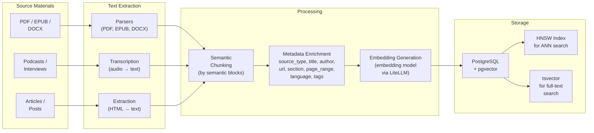
```mermaid
flowchart LR
    subgraph SOURCES["Source Materials"]
        PDF["PDF / EPUB /<br/>DOCX"]
        AUDIO["Podcasts /<br/>Interviews"]
        WEB["Articles /<br/>Posts"]
    end

    subgraph EXTRACT["Text Extraction"]
        PARSER["Parsers<br/>(PDF, EPUB, DOCX)"]
        TRANSCRIBE["Transcription<br/>(audio → text)"]
        SCRAPER["Extraction<br/>(HTML → text)"]
    end

    subgraph PROCESS["Processing"]
        CHUNK["Semantic<br/>Chunking<br/>(by semantic blocks)"]
        META["Metadata Enrichment<br/>source_type, title, author,<br/>url, section, page_range,<br/>language, tags"]
        EMBED["Embedding Generation<br/>(embedding model<br/>via LiteLLM)"]
    end

    subgraph STORE["Storage"]
        PG["PostgreSQL<br/>+ pgvector"]
        IDX["HNSW Index<br/>for ANN search"]
        FTS["tsvector<br/>for full-text<br/>search"]
    end

    PDF --> PARSER
    AUDIO --> TRANSCRIBE
    WEB --> SCRAPER

    PARSER --> CHUNK
    TRANSCRIBE --> CHUNK
    SCRAPER --> CHUNK

    CHUNK --> META --> EMBED
    EMBED --> PG
    PG --> IDX
    PG --> FTS
```

### 5.2 Query-Time Search

On each LLM call:

1. The text of the latest utterance (or several) is converted to an embedding using the same model.
2. PostgreSQL performs a hybrid search: semantic similarity (cosine distance, pgvector) + full-text (tsvector) + metadata filters (language, material type).
3. Top-K relevant chunks (K = 3–5, configurable) are included in the LLM context with source metadata.

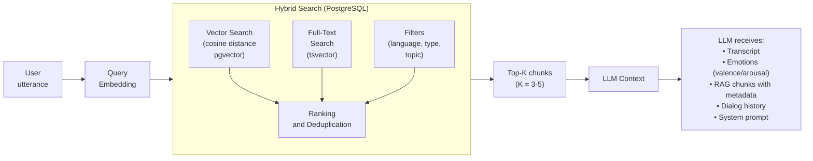
```mermaid
flowchart LR
    INPUT["User<br/>utterance"] --> Q_EMBED["Query<br/>Embedding"]

    Q_EMBED --> SEARCH

    subgraph SEARCH["Hybrid Search (PostgreSQL)"]
        direction TB
        VEC["Vector Search<br/>(cosine distance<br/>pgvector)"]
        FTS["Full-Text<br/>Search<br/>(tsvector)"]
        FILTER["Filters<br/>(language, type,<br/>topic)"]
        RANK["Ranking<br/>and Deduplication"]

        VEC --> RANK
        FTS --> RANK
        FILTER --> RANK
    end

    SEARCH --> TOPK["Top-K chunks<br/>(K = 3-5)"]
    TOPK --> CONTEXT["LLM Context"]

    CONTEXT --> LLM_IN["LLM receives:<br/>• Transcript<br/>• Emotions (valence/arousal)<br/>• RAG chunks with metadata<br/>• Dialog history<br/>• System prompt"]
```

### 5.3 Source Attribution (from RAG to Popup)

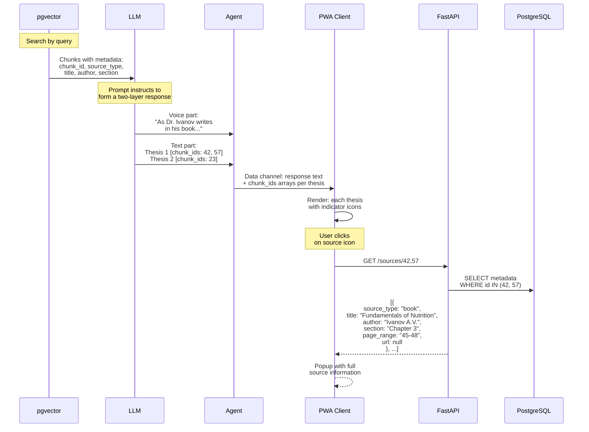
```mermaid
sequenceDiagram
    participant RAG as pgvector
    participant LLM as LLM
    participant AG as Agent
    participant PWA as PWA Client
    participant API as FastAPI
    participant DB as PostgreSQL

    Note over RAG: Search by query
    RAG->>LLM: Chunks with metadata:<br/>chunk_id, source_type,<br/>title, author, section

    Note over LLM: Prompt instructs to<br/>form a two-layer response

    LLM->>AG: Voice part:<br/>"As Dr. Ivanov writes<br/>in his book..."

    LLM->>AG: Text part:<br/>Thesis 1 [chunk_ids: 42, 57]<br/>Thesis 2 [chunk_ids: 23]

    AG->>PWA: Data channel: response text<br/>+ chunk_ids arrays per thesis
    PWA->>PWA: Render: each thesis<br/>with indicator icons

    Note over PWA: User clicks<br/>on source icon

    PWA->>API: GET /sources/42,57
    API->>DB: SELECT metadata<br/>WHERE id IN (42, 57)
    API-->>PWA: [{<br/>  source_type: "book",<br/>  title: "Fundamentals of Nutrition",<br/>  author: "Ivanov A.V.",<br/>  section: "Chapter 3",<br/>  page_range: "45-48",<br/>  url: null<br/>}, ...]

    PWA-->>PWA: Popup with full<br/>source information
```

---

## 6. Authentication and Tokens

### 6.1 JWT Lifecycle

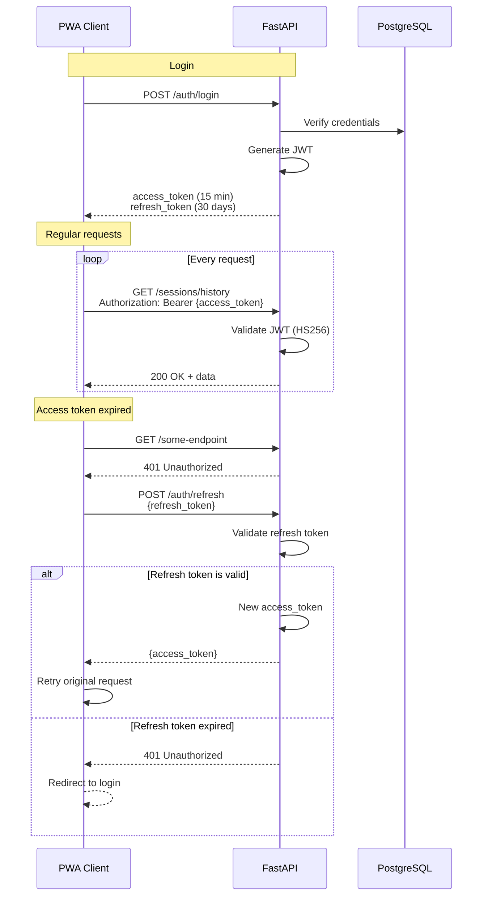
```mermaid
sequenceDiagram
    participant PWA as PWA Client
    participant API as FastAPI
    participant DB as PostgreSQL

    Note over PWA,API: Login
    PWA->>API: POST /auth/login
    API->>DB: Verify credentials
    API->>API: Generate JWT
    API-->>PWA: access_token (15 min)<br/>refresh_token (30 days)

    Note over PWA: Regular requests
    loop Every request
        PWA->>API: GET /sessions/history<br/>Authorization: Bearer {access_token}
        API->>API: Validate JWT (HS256)
        API-->>PWA: 200 OK + data
    end

    Note over PWA: Access token expired
    PWA->>API: GET /some-endpoint
    API-->>PWA: 401 Unauthorized

    PWA->>API: POST /auth/refresh<br/>{refresh_token}
    API->>API: Validate refresh token
    alt Refresh token is valid
        API->>API: New access_token
        API-->>PWA: {access_token}
        PWA->>PWA: Retry original request
    else Refresh token expired
        API-->>PWA: 401 Unauthorized
        PWA-->>PWA: Redirect to login
    end
```

### 6.2 LiveKit Token Generation

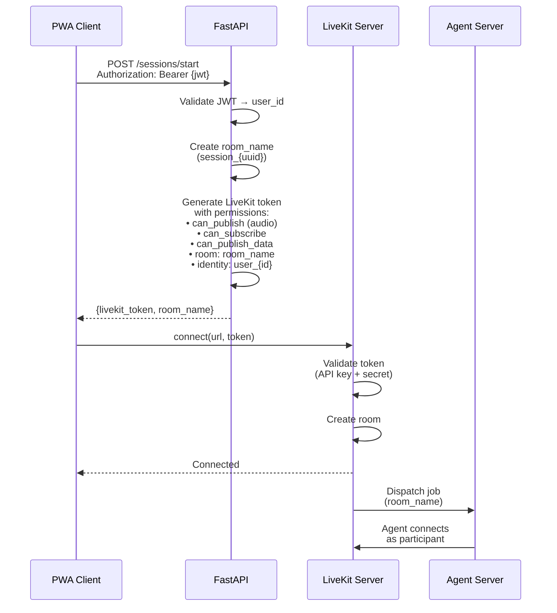
```mermaid
sequenceDiagram
    participant PWA as PWA Client
    participant API as FastAPI
    participant LK as LiveKit Server
    participant AG as Agent Server

    PWA->>API: POST /sessions/start<br/>Authorization: Bearer {jwt}
    API->>API: Validate JWT → user_id
    API->>API: Create room_name<br/>(session_{uuid})
    API->>API: Generate LiveKit token<br/>with permissions:<br/>• can_publish (audio)<br/>• can_subscribe<br/>• can_publish_data<br/>• room: room_name<br/>• identity: user_{id}
    API-->>PWA: {livekit_token, room_name}

    PWA->>LK: connect(url, token)
    LK->>LK: Validate token<br/>(API key + secret)
    LK->>LK: Create room
    LK-->>PWA: Connected

    LK->>AG: Dispatch job<br/>(room_name)
    AG->>LK: Agent connects<br/>as participant
```

---

## 7. Emotional Model

### 7.1 Circumplex Data Flow

**Implementation (MVP) — hybrid approach:**

- **Fast signal** — sentiment score from Deepgram (-1..1) for each transcript segment. Arrives with no additional latency as part of the STT result.
- **LLM interpretation** — the LLM is instructed via the system prompt to assess the state in a two-dimensional space (valence/arousal) based on text, sentiment score, context of previous utterances, and dynamics (trend). Does not require a separate ML classifier — operates within the existing LLM call.

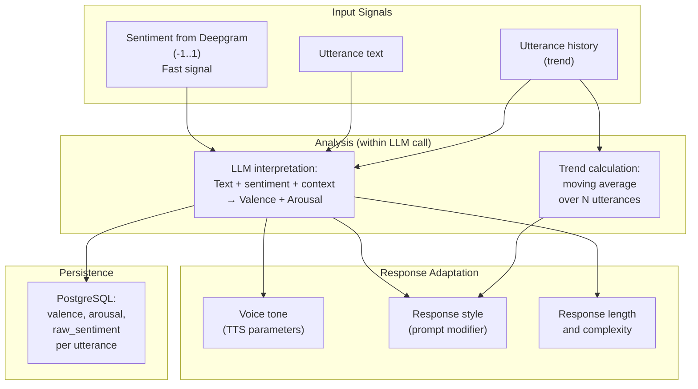
```mermaid
flowchart TB
    subgraph INPUT["Input Signals"]
        STT_SENT["Sentiment from Deepgram<br/>(-1..1)<br/>Fast signal"]
        TEXT["Utterance text"]
        HISTORY["Utterance history<br/>(trend)"]
    end

    subgraph ANALYSIS["Analysis (within LLM call)"]
        INTERPRET["LLM interpretation:<br/>Text + sentiment + context<br/>→ Valence + Arousal"]
        TREND["Trend calculation:<br/>moving average<br/>over N utterances"]
    end

    subgraph ADAPTATION["Response Adaptation"]
        TONE["Voice tone<br/>(TTS parameters)"]
        STYLE["Response style<br/>(prompt modifier)"]
        LENGTH["Response length<br/>and complexity"]
    end

    STT_SENT --> INTERPRET
    TEXT --> INTERPRET
    HISTORY --> INTERPRET
    HISTORY --> TREND

    INTERPRET --> TONE
    INTERPRET --> STYLE
    TREND --> STYLE
    INTERPRET --> LENGTH

    subgraph PERSIST["Persistence"]
        DB["PostgreSQL:<br/>valence, arousal,<br/>raw_sentiment<br/>per utterance"]
    end

    INTERPRET --> DB
```

### 7.2 Circumplex Quadrants

```mermaid
quadrantChart
    title Circumplex Model: Emotional States
    x-axis "Negative Valence" --> "Positive Valence"
    y-axis "Low Arousal" --> "High Arousal"
    quadrant-1 "Enthusiasm, Joy"
    quadrant-2 "Panic, Anxiety"
    quadrant-3 "Apathy, Depression"
    quadrant-4 "Calm, Contentment"
    "Panic attack": [0.15, 0.9]
    "Anxiety": [0.25, 0.75]
    "Anger": [0.1, 0.85]
    "Sadness": [0.2, 0.3]
    "Apathy": [0.15, 0.15]
    "Boredom": [0.35, 0.2]
    "Calm": [0.7, 0.3]
    "Contentment": [0.75, 0.4]
    "Joy": [0.8, 0.75]
    "Enthusiasm": [0.85, 0.85]
    "Interest": [0.65, 0.65]
    "Neutral": [0.5, 0.5]
```

### 7.3 Session Emotional Background Tracking

Beyond the current assessment, a rolling emotional background is maintained in the LLM context:

- Average valence/arousal values over the last N utterances
- Trend (improving or worsening)
- Points of sharp change

This allows the LLM to account for dynamics: if the user started positively but the state is worsening, the agent reacts to the trend, not just the latest utterance.

---

## 8. Session and Context Management

### Unified Dialog Context

The context aggregator in LiveKit Agents automatically collects user utterances (after STT) and agent responses (after TTS) into a unified context object. All messages — text and transcribed voice — are stored in a single chain in a format compatible with the OpenAI Messages API.

### Context Window and History

Context length is limited by the LLM window size. Strategies for long sessions:

- **Summarization** — older messages are compressed into a brief summary
- **Sliding window** — the last N utterances + summary of previous ones
- **Hybrid approach** — a combination of both strategies

The specific strategy choice is determined at the implementation stage.

### Persistence

Each session is recorded in PostgreSQL:
- Full message history (text, source — voice or text, timestamp)
- Emotional data for each utterance (valence, arousal, raw sentiment)
- Metadata of used RAG chunks

On reconnection, context from previous sessions can be loaded (in summarized form) for long-term agent memory.

---

## 9. Agent Lifecycle

### 9.1 LiveKit Agent Server: Job Lifecycle

```mermaid
stateDiagram-v2
    [*] --> registering: Agent container starts
    registering: Registering with LiveKit Server
    registering --> idle: Connection established
    idle: Awaiting dispatch

    idle --> job: LiveKit dispatch job (new room)

    state job {
        [*] --> spawn
        spawn: Separate Python process
        spawn --> load_cfg: Load prompts from PostgreSQL
        load_cfg --> connect: Connect to room
        connect --> wait_user: Awaiting user
        wait_user --> active: User connected
    }

    state active {
        [*] --> pipeline
        pipeline: Voice/Text Pipeline — processing utterances, RAG, LLM, TTS
    }

    active --> cleanup: User disconnected or shutdown()

    state cleanup {
        [*] --> drain
        drain: Drain pending speech (graceful)
        drain --> save
        save: Save session state to PostgreSQL
        save --> disconnect
        disconnect: Disconnect from room
    }

    cleanup --> idle: Process finished, server ready
    cleanup --> [*]: Server shutting down
```

### 9.2 Graceful Shutdown During Deployment

```mermaid
sequenceDiagram
    participant DEPLOY as Deploy (new version)
    participant AS as Agent Server
    participant JOB1 as Job 1 (active session)
    participant JOB2 as Job 2 (active session)
    participant LK as LiveKit Server
    participant DB as PostgreSQL

    DEPLOY->>AS: SIGTERM

    Note over AS: Graceful shutdown started

    AS->>AS: Stop accepting<br/>new jobs
    AS->>LK: Status: draining

    par Completing active sessions
        AS->>JOB1: Shutdown signal
        JOB1->>JOB1: Drain pending speech
        JOB1->>DB: Save state
        JOB1->>LK: Disconnect from room
        JOB1-->>AS: Completed

    and
        AS->>JOB2: Shutdown signal
        JOB2->>JOB2: Drain pending speech
        JOB2->>DB: Save state
        JOB2->>LK: Disconnect from room
        JOB2-->>AS: Completed
    end

    Note over AS: All jobs completed<br/>(or drain_timeout expired)

    AS->>AS: Cleanup
    AS-->>DEPLOY: Process finished

    DEPLOY->>DEPLOY: Start new container
```

---

## 10. Database

### 10.1 ER Diagram

```mermaid
erDiagram
    users {
        uuid id PK
        string email UK
        string password_hash
        boolean is_verified
        string verification_code
        timestamp verification_expires_at
        jsonb preferences
        timestamp created_at
        timestamp updated_at
    }

    sessions {
        uuid id PK
        uuid user_id FK
        string room_name
        string status "active | completed | error"
        jsonb agent_config_snapshot
        timestamp started_at
        timestamp ended_at
    }

    messages {
        uuid id PK
        uuid session_id FK
        string role "user | assistant"
        string mode "voice | text"
        text content
        text voice_transcript "if voice"
        float sentiment_raw "from Deepgram"
        float valence
        float arousal
        jsonb source_ids "RAG chunk IDs"
        timestamp created_at
    }

    knowledge_sources {
        uuid id PK
        string source_type "book | video | podcast | article | post"
        string title
        string author
        string url
        string language
        jsonb tags
        timestamp created_at
    }

    knowledge_chunks {
        uuid id PK
        uuid source_id FK
        text content
        string section "chapter, section, timestamp"
        string page_range
        vector embedding "pgvector"
        tsvector search_vector "full-text"
        integer token_count
        timestamp created_at
    }

    agent_config {
        uuid id PK
        string key UK "system_prompt | voice_prompt | etc"
        text value
        integer version
        boolean is_active
        timestamp created_at
        timestamp updated_at
    }

    tts_config {
        uuid id PK
        string voice_id
        string model_id "inworld-tts-1.5-max"
        float expressiveness "0.0 - 1.0"
        float speed "0.5 - 2.0"
        string language
        boolean is_active
        timestamp created_at
    }

    users ||--o{ sessions : "has"
    sessions ||--o{ messages : "contains"
    knowledge_sources ||--o{ knowledge_chunks : "split into"
```

---

## 11. Provider Replacement

### STT Replacement Process

1. Verify the new provider is supported by LiveKit Agents (natively: Deepgram, Google, Azure, AssemblyAI, Groq, and others).
2. Add the API key to the agent container environment variables.
3. Switch the plugin in the AgentSession configuration.

No changes required: pipeline logic, context, LLM, TTS, RAG, DB.

Note: if the new STT does not provide sentiment analysis (like Deepgram does), the fast emotional signal will not be available. LLM-based emotion interpretation will continue to work based on text and context.

### LLM Replacement Process

1. Add the API key to the litellm container environment variables.
2. Update `litellm.yaml` (add/replace the entry).
3. Restart the litellm container.

No changes required: agent code, STT/TTS, pipeline, DB. Through LiteLLM, self-hosted models (Ollama, vLLM) can be connected via a local address.

### TTS Replacement Process

1. Verify the provider is supported by LiveKit Agents (natively: ElevenLabs, Cartesia, Google, Azure, PlayHT, Deepgram, and others).
2. Add the API key to the agent container environment variables.
3. Switch the plugin in the AgentSession configuration.

No changes required: pipeline logic, STT, LLM, RAG, DB.

### Unsupported Provider

For STT/TTS: implement a custom plugin that implements the standard LiveKit Agents interface. Scope — a single module wrapping the provider API. For LLM: add a custom provider to LiteLLM (most are already supported).

```mermaid
flowchart TD
    START["Decision to replace provider"]

    START --> TYPE{Which component?}

    TYPE -->|"STT"| STT_CHECK{"Native LiveKit<br/>plugin available?"}
    TYPE -->|"LLM"| LLM_CHECK{"Supported<br/>by LiteLLM?"}
    TYPE -->|"TTS"| TTS_CHECK{"Native LiveKit<br/>plugin available?"}

    STT_CHECK -->|"Yes"| STT_NATIVE["1. Add API key to .env<br/>2. Switch plugin in AgentSession<br/>3. Restart agent container"]
    STT_CHECK -->|"No"| STT_CUSTOM["1. Write custom plugin<br/>(implement STT interface)<br/>2. Add API key to .env<br/>3. Restart agent container"]

    LLM_CHECK -->|"Yes"| LLM_NATIVE["1. Add API key to .env<br/>2. Update litellm.yaml<br/>3. Restart litellm container"]
    LLM_CHECK -->|"No, OpenAI-compatible"| LLM_COMPAT["1. Set base_url + key<br/>in litellm.yaml<br/>2. Restart litellm container"]
    LLM_CHECK -->|"No, incompatible"| LLM_CUSTOM["1. Write custom provider<br/>for LiteLLM<br/>2. Update litellm.yaml<br/>3. Restart litellm container"]

    TTS_CHECK -->|"Yes"| TTS_NATIVE["1. Add API key to .env<br/>2. Switch plugin in AgentSession<br/>3. Restart agent container"]
    TTS_CHECK -->|"No"| TTS_CUSTOM["1. Write custom plugin<br/>(implement TTS interface)<br/>2. Add API key to .env<br/>3. Restart agent container"]

    STT_NATIVE --> VERIFY
    STT_CUSTOM --> VERIFY
    LLM_NATIVE --> VERIFY
    LLM_COMPAT --> VERIFY
    LLM_CUSTOM --> VERIFY
    TTS_NATIVE --> VERIFY
    TTS_CUSTOM --> VERIFY

    VERIFY["UX Verification:<br/>testing with new provider<br/>via Agents Playground"]

    style START fill:#e8f5e9
    style VERIFY fill:#fff3e0
```

---

## 12. Monitoring and Observability

### Pipeline Metrics

LiveKit Agents provides built-in metrics collection:
- Latency for each stage (STT, LLM, TTS)
- Total voice-to-voice time
- Number of interruptions
- LLM token usage

LiveKit Server: number of active connections, media quality, packet loss.

### Session Logging

Each session logs:
- Full dialog history with timestamps
- Emotional data for each utterance (valence, arousal, raw sentiment)
- Used RAG chunks and their relevance
- Latency metrics for each stage
- STT/LLM/TTS errors
- Crisis protocol activations

### LLM Observability (Post-MVP)

For analyzing response quality, RAG selection correctness, and emotional adaptation, integration of an LLM tracing tool (Langfuse, Phoenix, or similar) is planned. This will allow tracking: which RAG chunks were retrieved, how relevant they were, how the LLM used context, and at which points the crisis protocol was triggered. LiteLLM supports Langfuse integration.

### Alerting

Required alerts:
- Voice-to-voice latency exceeding target (over 2 seconds)
- Connection errors to external APIs (STT, LLM, TTS)
- VPS resource exhaustion (CPU > 80%, RAM > 85%)
- Docker container unavailability
- LiveKit Server errors (connection refusal, TURN issues)

---

## 13. Scaling (Post-MVP)

The current architecture is designed for tens of concurrent sessions on a single VPS. Growth directions:

### Horizontal Agent Scaling

LiveKit Agent Server natively supports horizontal scaling. Multiple Agent Servers connect to a single LiveKit Server, and load balancing distributes jobs automatically. Each agent is stateless — state is in PostgreSQL. Docker Compose can be replaced with Docker Swarm or Kubernetes.

### LiveKit Clustering

LiveKit Server supports cluster mode with multiple nodes. If needed — transition to LiveKit Cloud for managed scaling.

### Self-Hosted STT/TTS

To reduce costs or improve privacy:
- **STT:** Faster-Whisper on a GPU node
- **TTS:** XTTS v2 or Kokoro on a GPU node

Replacement — switch the plugin in the AgentSession configuration.

### Self-Hosted LLM

Through LiteLLM, Ollama, vLLM, or similar can be connected. Requires GPU (NVIDIA RTX 4090 24 GB or equivalent). Agent code is not affected.

### Multi-Agent Architecture

Adding agents with different specializations via explicit dispatch in LiveKit Agent Server. Agents register under different `agent_name` values and are dispatched by request type.
