# Архитектура проекта

**Версия:** 2.0 — MVP
**Дата:** март 2026

> Техническая архитектура системы: компоненты, потоки данных, протоколы. Описание продукта — в [about.md](about.md), спецификации стека — в [specs.md](specs.md).

---

## 1. Системная архитектура

### 1.1 Общая архитектура

Система состоит из семи Docker-контейнеров на одном VPS, взаимодействующих с PWA-клиентом и внешними API-провайдерами.

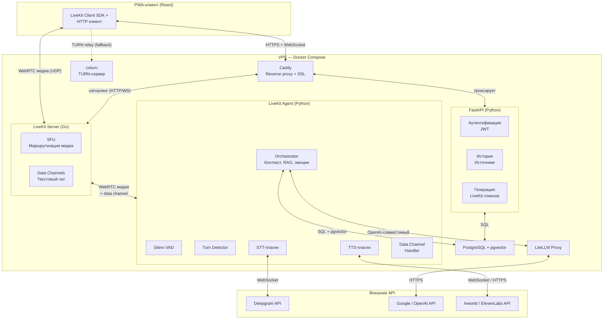
```mermaid
graph TB
    subgraph CLIENT["PWA-клиент (React)"]
        UI["LiveKit Client SDK +<br/>HTTP клиент"]
    end

    subgraph VPS["VPS — Docker Compose"]
        CADDY["Caddy<br/>Reverse proxy + SSL"]

        subgraph API_SVC["FastAPI (Python)"]
            AUTH["Аутентификация<br/>JWT"]
            HISTORY["История<br/>Источники"]
            LK_TOKEN["Генерация<br/>LiveKit-токенов"]
        end

        subgraph LIVEKIT_SVC["LiveKit Server (Go)"]
            SFU["SFU<br/>Маршрутизация медиа"]
            DC["Data Channels<br/>Текстовый чат"]
        end

        COTURN["coturn<br/>TURN-сервер"]

        subgraph AGENT["LiveKit Agent (Python)"]
            VAD["Silero VAD"]
            TD["Turn Detector"]
            STT_P["STT-плагин"]
            ORCH["Orchestrator<br/>Контекст, RAG, эмоции"]
            TTS_P["TTS-плагин"]
            DC_HANDLER["Data Channel<br/>Handler"]
        end

        LITELLM["LiteLLM Proxy"]
        PG["PostgreSQL + pgvector"]
    end

    subgraph EXT["Внешние API"]
        STT_API["Deepgram API"]
        LLM_API["Google / OpenAI API"]
        TTS_API["Inworld / ElevenLabs API"]
    end

    UI <-->|"HTTPS + WebSocket"| CADDY
    UI <-->|"WebRTC медиа (UDP)"| LIVEKIT_SVC
    CADDY <-->|"сигналинг (HTTP/WS)"| LIVEKIT_SVC
    CADDY <-->|"проксирует"| API_SVC
    LIVEKIT_SVC <-->|"WebRTC медиа<br/>+ data channel"| AGENT
    UI -.->|"TURN relay (fallback)"| COTURN
    ORCH <-->|"SQL + pgvector"| PG
    ORCH <-->|"OpenAI-совместимый"| LITELLM
    API_SVC <-->|"SQL"| PG
    STT_P <-->|"WebSocket"| STT_API
    LITELLM <-->|"HTTPS"| LLM_API
    TTS_P <-->|"WebSocket / HTTPS"| TTS_API
```

**Разделение сигналинга и медиа.** LiveKit использует два типа соединений:

- **Сигналинг (HTTP/WebSocket)** — управление комнатами, авторизация, обмен ICE-кандидатами. Проксируется через Caddy (порт 443) с TLS-терминацией.
- **Медиа (UDP)** — аудио/видеопотоки (RTP/RTCP). Идут **напрямую** между клиентом и LiveKit Server по UDP, минуя Caddy. LiveKit публикует диапазон UDP-портов (50000–60000) для прямого ICE-подключения.

Caddy **не проксирует медиа-трафик** — HTTP reverse proxy не способен обрабатывать WebRTC UDP-потоки. Клиент получает ICE-кандидаты через сигналинг и устанавливает прямое UDP-соединение с LiveKit.

TURN-сервер (coturn) — **fallback** для клиентов за жёстким NAT (корпоративные сети, мобильные операторы, Symmetric NAT). Прямое UDP-соединение приоритетнее — TURN увеличивает задержку. Все соединения шифрованы (DTLS-SRTP).

**LiteLLM Proxy** находится на критическом пути голосового pipeline — его недоступность означает невозможность генерации ответов. Необходимы: health check контейнера, таймауты на запросы со стороны агента, корректная обработка ситуации «LLM недоступен» (агент сообщает пользователю о проблеме, а не зависает). В зависимости от режима запуска для применения изменений конфигурации может потребоваться рестарт LiteLLM-контейнера.

### 1.2 Docker Compose топология

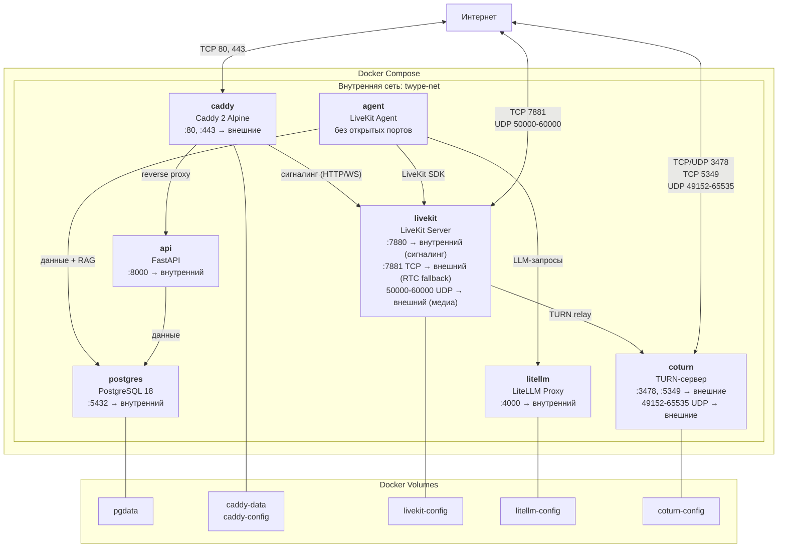
```mermaid
graph TB
    subgraph COMPOSE["Docker Compose"]
        direction TB

        subgraph NET["Внутренняя сеть: twype-net"]
            CADDY["<b>caddy</b><br/>Caddy 2 Alpine<br/>:80, :443 → внешние"]
            API["<b>api</b><br/>FastAPI<br/>:8000 → внутренний"]
            LIVEKIT["<b>livekit</b><br/>LiveKit Server<br/>:7880 → внутренний (сигналинг)<br/>:7881 TCP → внешний (RTC fallback)<br/>50000-60000 UDP → внешний (медиа)"]
            AGENT["<b>agent</b><br/>LiveKit Agent<br/>без открытых портов"]
            LITELLM["<b>litellm</b><br/>LiteLLM Proxy<br/>:4000 → внутренний"]
            PG["<b>postgres</b><br/>PostgreSQL 18<br/>:5432 → внутренний"]
            COTURN["<b>coturn</b><br/>TURN-сервер<br/>:3478, :5349 → внешние<br/>49152-65535 UDP → внешние"]
        end
    end

    subgraph VOL["Docker Volumes"]
        V_PG["pgdata"]
        V_CADDY["caddy-data<br/>caddy-config"]
        V_LK["livekit-config"]
        V_LLM["litellm-config"]
        V_TURN["coturn-config"]
    end

    PG --- V_PG
    CADDY --- V_CADDY
    LIVEKIT --- V_LK
    LITELLM --- V_LLM
    COTURN --- V_TURN

    CADDY -->|"сигналинг (HTTP/WS)"| LIVEKIT
    CADDY -->|"reverse proxy"| API
    AGENT -->|"LiveKit SDK"| LIVEKIT
    AGENT -->|"LLM-запросы"| LITELLM
    AGENT -->|"данные + RAG"| PG
    API -->|"данные"| PG
    LIVEKIT -->|"TURN relay"| COTURN

    INET["Интернет"] <-->|"TCP 80, 443"| CADDY
    INET <-->|"TCP 7881<br/>UDP 50000-60000"| LIVEKIT
    INET <-->|"TCP/UDP 3478<br/>TCP 5349<br/>UDP 49152-65535"| COTURN
```

Состав контейнеров:

- **api** — FastAPI (Python). REST API: аутентификация, генерация LiveKit-токенов, история диалогов, метаданные источников, администрирование. Подключается к PostgreSQL. Проксируется через Caddy. Зависит от postgres.
- **agent** — LiveKit Agent (Python). Voice pipeline (VAD, Turn Detection, STT/TTS-плагины), обработка контекста, эмоции, RAG. Кастомный TTS-плагин Inworld (разрабатывается с прицелом на PR в репозиторий LiveKit Agents; независимо от принятия используется как локальный модуль). Зависит от livekit, litellm, postgres.
- **livekit** — LiveKit Server (Go). SFU-медиасервер: комнаты, маршрутизация медиапотоков, авторизация участников. Легковесный (~50–100 MB RAM). Конфигурация через YAML-файл (volume). Порт 7880 (сигналинг) проксируется через Caddy; порты 7881 TCP и 50000–60000 UDP — напрямую наружу.
- **coturn** — TURN-сервер. Relay WebRTC-трафика для клиентов за жёстким NAT. Обязательный компонент для стабильного коннекта в реальных сетевых условиях.
- **litellm** — LiteLLM Proxy. OpenAI-совместимый шлюз к LLM-провайдерам. Конфигурация через YAML-файл (volume).
- **postgres** — PostgreSQL 18 + pgvector. Все данные приложения и RAG-эмбеддинги. Персистенция через Docker volume.
- **caddy** — Caddy 2 Alpine. Reverse proxy + автоматический SSL (Let's Encrypt). Проксирует HTTP/WS к LiveKit (сигналинг) и REST API к FastAPI. **Не проксирует WebRTC медиа.**

**Требования к серверу** (10–30 одновременных голосовых сессий):

| Ресурс | Требование |
|--------|-----------|
| CPU | 4–8 ядер |
| RAM | 8–16 GB |
| Диск | 50 GB SSD |
| ОС | Ubuntu 22.04+ (любой Linux с Docker) |

Каждая активная сессия агента — отдельный Python-процесс (~100–200 MB RAM). Основная нагрузка — сетевая (WebRTC через SFU) и I/O (обращения к внешним API).

### 1.3 Сетевая карта

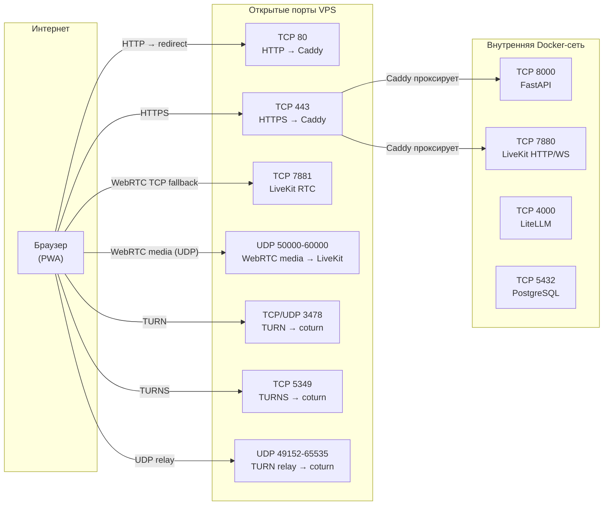
```mermaid
graph LR
    subgraph INTERNET["Интернет"]
        BROWSER["Браузер<br/>(PWA)"]
    end

    subgraph FIREWALL["Открытые порты VPS"]
        P80["TCP 80<br/>HTTP → Caddy"]
        P443["TCP 443<br/>HTTPS → Caddy"]
        P7881["TCP 7881<br/>WebRTC TCP fallback → LiveKit"]
        PLKUDP["UDP 50000-60000<br/>WebRTC media → LiveKit"]
        P3478["TCP/UDP 3478<br/>TURN → coturn"]
        P5349["TCP 5349<br/>TURNS → coturn"]
        PUDP["UDP 49152-65535<br/>TURN relay → coturn"]
    end

    subgraph INTERNAL["Внутренняя Docker-сеть"]
        P8000["TCP 8000<br/>FastAPI"]
        P7880["TCP 7880<br/>LiveKit HTTP/WS"]
        P7881["TCP 7881<br/>LiveKit RTC"]
        P4000["TCP 4000<br/>LiteLLM"]
        P5432["TCP 5432<br/>PostgreSQL"]
    end

    BROWSER -->|"HTTPS"| P443
    BROWSER -->|"HTTP → redirect"| P80
    BROWSER -->|"WebRTC media (UDP)"| PLKUDP
    BROWSER -->|"WebRTC TCP fallback"| P7881
    BROWSER -->|"TURN"| P3478
    BROWSER -->|"TURNS"| P5349
    BROWSER -->|"UDP relay"| PUDP

    P443 -->|"Caddy проксирует"| P8000
    P443 -->|"Caddy проксирует"| P7880
```

Сводка сетевых требований:

| Порт | Протокол | Назначение |
|------|----------|-----------|
| 80 | TCP | HTTP → Caddy (редирект на HTTPS) |
| 443 | TCP | HTTPS → Caddy (API + сигналинг LiveKit) |
| 7880 | TCP | LiveKit API/WebSocket (внутренний, через Caddy) |
| 7881 | TCP | LiveKit WebRTC TCP fallback (публичный) |
| 50000–60000 | UDP | LiveKit WebRTC медиа RTP/RTCP (публичный) |
| 3478 | TCP/UDP | TURN (coturn) |
| 5349 | TCP | TURN over TLS (coturn) |
| 49152–65535 | UDP | TURN relay range (coturn) |

---

## 2. Структура monorepo

### 2.1 Директории проекта

```mermaid
graph TD
    ROOT["twype-voice/"]

    ROOT --> APPS["apps/"]
    ROOT --> PKGS["packages/"]
    ROOT --> DOCKER["docker/"]
    ROOT --> CONFIGS["configs/"]
    ROOT --> SCRIPTS["scripts/"]
    ROOT --> DOCS["docs/"]

    APPS --> API["api/<br/>FastAPI REST API"]
    APPS --> AGENT["agent/<br/>LiveKit Agent"]
    APPS --> WEB["web/<br/>React PWA"]

    API --> API_SRC["src/<br/>auth/ routes/ models/<br/>schemas/ services/ main.py"]
    API --> API_MIG["migrations/<br/>Alembic"]
    API --> API_TEST["tests/"]

    AGENT --> AG_SRC["src/<br/>plugins/ prompts/ rag/<br/>emotions/ main.py"]
    AGENT --> AG_TEST["tests/"]

    WEB --> WEB_SRC["src/<br/>components/ hooks/<br/>pages/ lib/ main.tsx"]
    WEB --> WEB_PUB["public/"]
    WEB --> WEB_TEST["tests/"]

    PKGS --> SHARED["shared/<br/>Общие типы"]

    DOCKER --> DF_API["Dockerfile.api"]
    DOCKER --> DF_AG["Dockerfile.agent"]
    DOCKER --> DF_WEB["Dockerfile.web"]
    DOCKER --> DC_PROD["docker-compose.yml"]
    DOCKER --> DC_DEV["docker-compose.dev.yml"]

    CONFIGS --> C_LK["livekit.yaml"]
    CONFIGS --> C_LLM["litellm.yaml"]
    CONFIGS --> C_CADDY["caddy/Caddyfile"]
    CONFIGS --> C_TURN["coturn/turnserver.conf"]

    SCRIPTS --> S_SEED["seed.py"]
    SCRIPTS --> S_INGEST["ingest.py"]
    SCRIPTS --> S_MIGRATE["migrate.sh"]
```

---

## 3. User Flows

### 3.1 Регистрация и верификация email

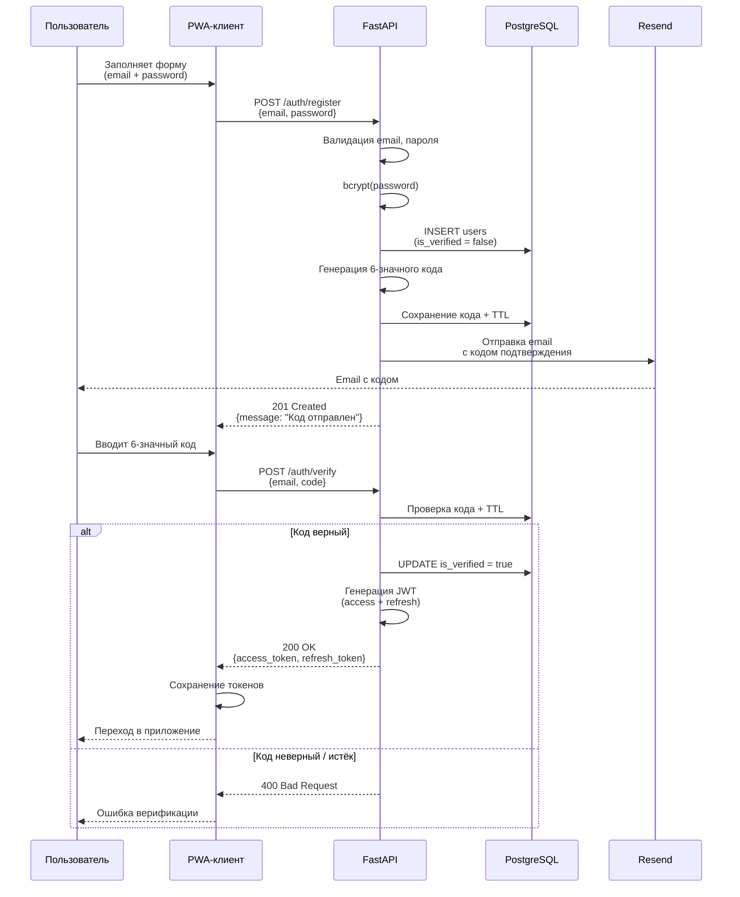
```mermaid
sequenceDiagram
    participant U as Пользователь
    participant PWA as PWA-клиент
    participant API as FastAPI
    participant DB as PostgreSQL
    participant R as Resend

    U->>PWA: Заполняет форму<br/>(email + password)
    PWA->>API: POST /auth/register<br/>{email, password}
    API->>API: Валидация email, пароля
    API->>API: bcrypt(password)
    API->>DB: INSERT users<br/>(is_verified = false)
    API->>API: Генерация 6-значного кода
    API->>DB: Сохранение кода + TTL
    API->>R: Отправка email<br/>с кодом подтверждения
    R-->>U: Email с кодом
    API-->>PWA: 201 Created<br/>{message: "Код отправлен"}

    U->>PWA: Вводит 6-значный код
    PWA->>API: POST /auth/verify<br/>{email, code}
    API->>DB: Проверка кода + TTL
    alt Код верный
        API->>DB: UPDATE is_verified = true
        API->>API: Генерация JWT<br/>(access + refresh)
        API-->>PWA: 200 OK<br/>{access_token, refresh_token}
        PWA->>PWA: Сохранение токенов
        PWA-->>U: Переход в приложение
    else Код неверный / истёк
        API-->>PWA: 400 Bad Request
        PWA-->>U: Ошибка верификации
    end
```

### 3.2 Логин и получение токенов

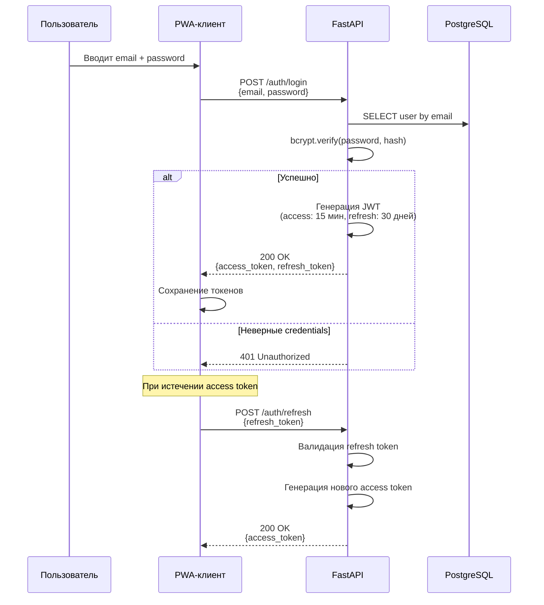
```mermaid
sequenceDiagram
    participant U as Пользователь
    participant PWA as PWA-клиент
    participant API as FastAPI
    participant DB as PostgreSQL

    U->>PWA: Вводит email + password
    PWA->>API: POST /auth/login<br/>{email, password}
    API->>DB: SELECT user by email
    API->>API: bcrypt.verify(password, hash)

    alt Успешно
        API->>API: Генерация JWT<br/>(access: 15 мин, refresh: 30 дней)
        API-->>PWA: 200 OK<br/>{access_token, refresh_token}
        PWA->>PWA: Сохранение токенов
    else Неверные credentials
        API-->>PWA: 401 Unauthorized
    end

    Note over PWA: При истечении access token
    PWA->>API: POST /auth/refresh<br/>{refresh_token}
    API->>API: Валидация refresh token
    API->>API: Генерация нового access token
    API-->>PWA: 200 OK<br/>{access_token}
```

### 3.3 Начало голосовой сессии

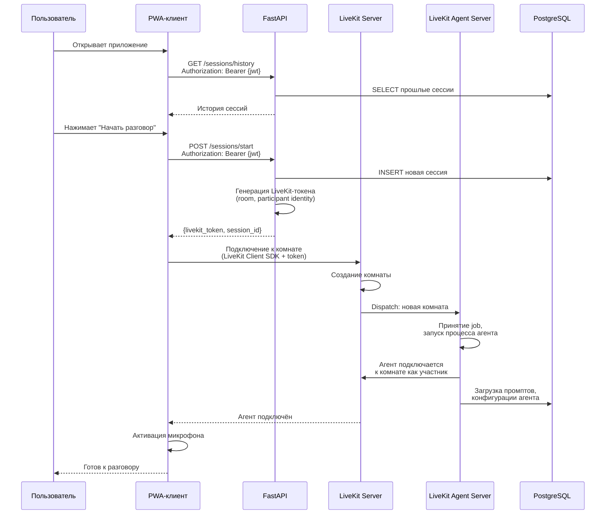
```mermaid
sequenceDiagram
    participant U as Пользователь
    participant PWA as PWA-клиент
    participant API as FastAPI
    participant LK as LiveKit Server
    participant AG as LiveKit Agent Server
    participant DB as PostgreSQL

    U->>PWA: Открывает приложение
    PWA->>API: GET /sessions/history<br/>Authorization: Bearer {jwt}
    API->>DB: SELECT прошлые сессии
    API-->>PWA: История сессий

    U->>PWA: Нажимает "Начать разговор"
    PWA->>API: POST /sessions/start<br/>Authorization: Bearer {jwt}
    API->>DB: INSERT новая сессия
    API->>API: Генерация LiveKit-токена<br/>(room, participant identity)
    API-->>PWA: {livekit_token, session_id}

    PWA->>LK: Подключение к комнате<br/>(LiveKit Client SDK + token)
    LK->>LK: Создание комнаты
    LK->>AG: Dispatch: новая комната

    AG->>AG: Принятие job,<br/>запуск процесса агента
    AG->>LK: Агент подключается<br/>к комнате как участник
    AG->>DB: Загрузка промптов,<br/>конфигурации агента

    LK-->>PWA: Агент подключён
    PWA->>PWA: Активация микрофона
    PWA-->>U: Готов к разговору
```

### 3.4 Голосовой диалог (полный цикл реплики)

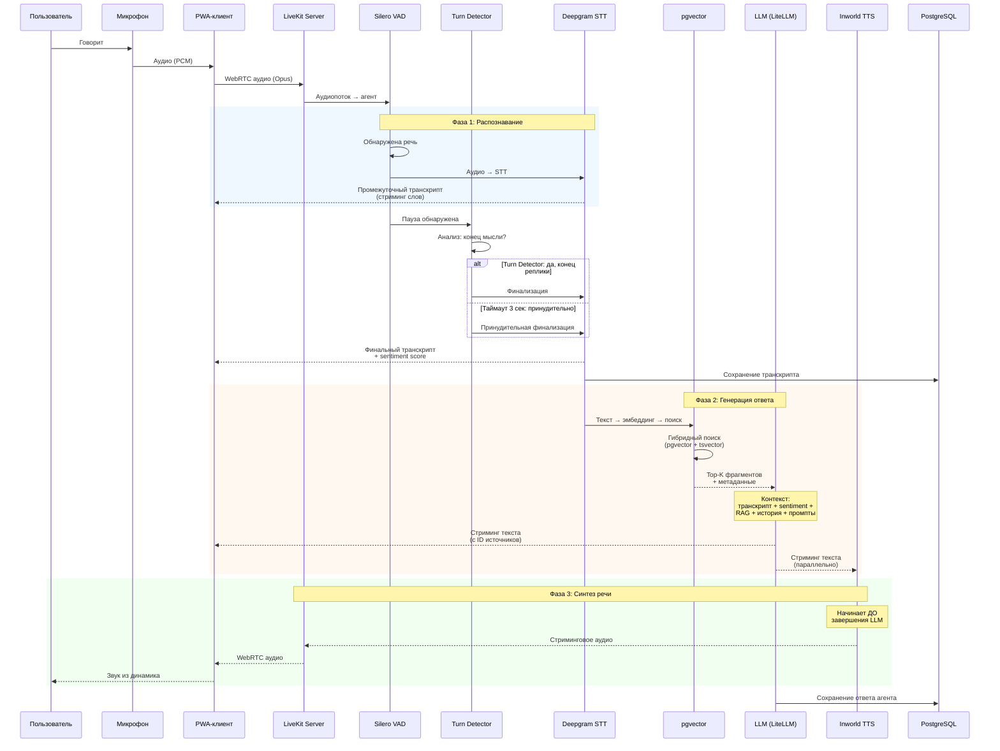
```mermaid
sequenceDiagram
    participant U as Пользователь
    participant MIC as Микрофон
    participant PWA as PWA-клиент
    participant LK as LiveKit Server
    participant VAD as Silero VAD
    participant TD as Turn Detector
    participant STT as Deepgram STT
    participant RAG as pgvector
    participant LLM as LLM (LiteLLM)
    participant TTS as Inworld TTS
    participant DB as PostgreSQL

    U->>MIC: Говорит
    MIC->>PWA: Аудио (PCM)
    PWA->>LK: WebRTC аудио (Opus)
    LK->>VAD: Аудиопоток → агент

    rect rgb(240, 248, 255)
        Note over VAD,STT: Фаза 1: Распознавание
        VAD->>VAD: Обнаружена речь
        VAD->>STT: Аудио → STT
        STT-->>PWA: Промежуточный транскрипт<br/>(стриминг слов)
    end

    VAD->>TD: Пауза обнаружена
    TD->>TD: Анализ: конец мысли?

    alt Turn Detector: да, конец реплики
        TD->>STT: Финализация
    else Таймаут 3 сек: принудительно
        TD->>STT: Принудительная финализация
    end

    STT-->>PWA: Финальный транскрипт<br/>+ sentiment score
    STT->>DB: Сохранение транскрипта

    rect rgb(255, 248, 240)
        Note over RAG,LLM: Фаза 2: Генерация ответа
        STT->>RAG: Текст → эмбеддинг → поиск
        RAG->>RAG: Гибридный поиск<br/>(pgvector + tsvector)
        RAG-->>LLM: Top-K фрагментов<br/>+ метаданные

        Note over LLM: Контекст:<br/>транскрипт + sentiment +<br/>RAG + история + промпты
        LLM-->>PWA: Стриминг текста<br/>(с ID источников)
        LLM-->>TTS: Стриминг текста<br/>(параллельно)
    end

    rect rgb(240, 255, 240)
        Note over TTS,LK: Фаза 3: Синтез речи
        Note over TTS: Начинает ДО<br/>завершения LLM
        TTS-->>LK: Стриминговое аудио
        LK-->>PWA: WebRTC аудио
        PWA-->>U: Звук из динамика
    end

    LLM->>DB: Сохранение ответа агента
```

### 3.5 Текстовый диалог

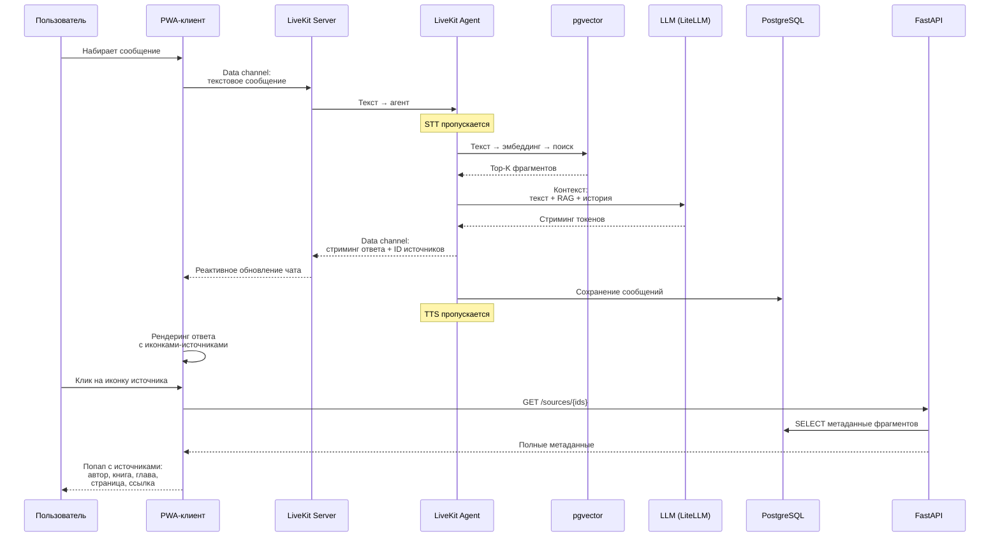
```mermaid
sequenceDiagram
    participant U as Пользователь
    participant PWA as PWA-клиент
    participant LK as LiveKit Server
    participant AG as LiveKit Agent
    participant RAG as pgvector
    participant LLM as LLM (LiteLLM)
    participant DB as PostgreSQL
    participant API as FastAPI

    U->>PWA: Набирает сообщение
    PWA->>LK: Data channel:<br/>текстовое сообщение
    LK->>AG: Текст → агент

    Note over AG: STT пропускается

    AG->>RAG: Текст → эмбеддинг → поиск
    RAG-->>AG: Top-K фрагментов

    AG->>LLM: Контекст:<br/>текст + RAG + история
    LLM-->>AG: Стриминг токенов

    AG-->>LK: Data channel:<br/>стриминг ответа + ID источников
    LK-->>PWA: Реактивное обновление чата
    AG->>DB: Сохранение сообщений

    Note over AG: TTS пропускается

    PWA->>PWA: Рендеринг ответа<br/>с иконками-источниками

    U->>PWA: Клик на иконку источника
    PWA->>API: GET /sources/{ids}
    API->>DB: SELECT метаданные фрагментов
    API-->>PWA: Полные метаданные
    PWA-->>U: Попап с источниками:<br/>автор, книга, глава,<br/>страница, ссылка
```

### 3.6 Переключение режимов: голос ↔ текст

Оба режима работают через единый реалтайм-транспорт — LiveKit. Голосовой режим использует WebRTC аудиотреки, текстовый — data channel. Переключение происходит на стороне клиента: активация/деактивация аудиотреков. Клиент всегда подключён к комнате — переключение мгновенное. Единая история диалога в PostgreSQL — агент видит все реплики из обоих режимов.

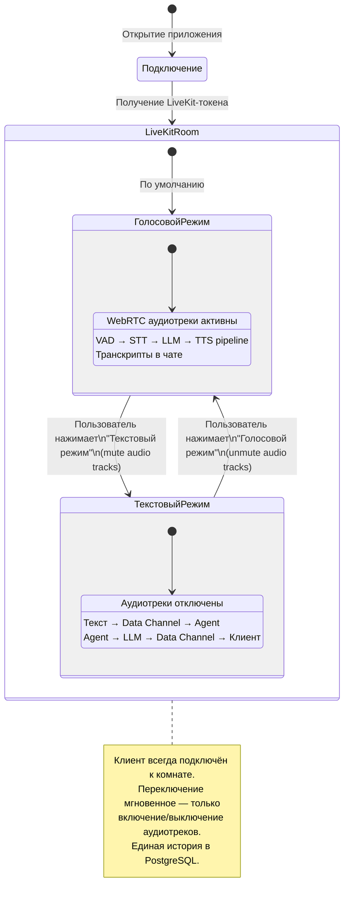
```mermaid
stateDiagram-v2
    [*] --> Подключение: Открытие приложения
    Подключение --> LiveKitRoom: Получение LiveKit-токена

    state LiveKitRoom {
        [*] --> ГолосовойРежим: По умолчанию

        state ГолосовойРежим {
            [*] --> АудиоАктивно
            АудиоАктивно: WebRTC аудиотреки активны
            АудиоАктивно: VAD → STT → LLM → TTS pipeline
            АудиоАктивно: Транскрипты в чате
        }

        state ТекстовыйРежим {
            [*] --> ДатаКанал
            ДатаКанал: Аудиотреки отключены
            ДатаКанал: Текст → Data Channel → Agent
            ДатаКанал: Agent → LLM → Data Channel → Клиент
        }

        ГолосовойРежим --> ТекстовыйРежим: Пользователь нажимает\n"Текстовый режим"\n(mute audio tracks)
        ТекстовыйРежим --> ГолосовойРежим: Пользователь нажимает\n"Голосовой режим"\n(unmute audio tracks)
    }

    note right of LiveKitRoom
        Клиент всегда подключён к комнате.
        Переключение мгновенное — только
        включение/выключение аудиотреков.
        Единая история в PostgreSQL.
    end note
```

---

## 4. Voice Pipeline

### 4.1 Компоненты pipeline (внутренняя архитектура агента)

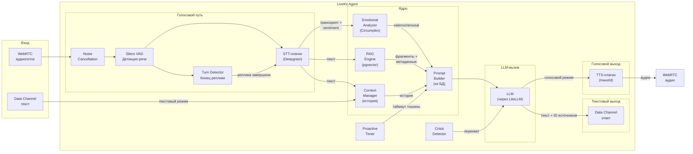
```mermaid
flowchart LR
    subgraph INPUT["Вход"]
        AUDIO["WebRTC<br/>аудиопоток"]
        TEXT["Data Channel<br/>текст"]
    end

    subgraph AGENT["LiveKit Agent"]
        subgraph VOICE_PATH["Голосовой путь"]
            VAD["Silero VAD<br/>Детекция речи"]
            NC["Noise<br/>Cancellation"]
            TD["Turn Detector<br/>Конец реплики"]
            STT["STT-плагин<br/>(Deepgram)"]
        end

        subgraph CORE["Ядро"]
            EMO["Emotional<br/>Analyzer<br/>(Circumplex)"]
            CTX["Context<br/>Manager<br/>(история)"]
            RAG["RAG<br/>Engine<br/>(pgvector)"]
            PROMPT["Prompt<br/>Builder<br/>(из БД)"]
        end

        subgraph LLM_CALL["LLM-вызов"]
            LLM["LLM<br/>(через LiteLLM)"]
        end

        subgraph OUTPUT_VOICE["Голосовой выход"]
            TTS["TTS-плагин<br/>(Inworld)"]
        end

        subgraph OUTPUT_TEXT["Текстовый выход"]
            DC_OUT["Data Channel<br/>ответ"]
        end

        PROACTIVE["Proactive<br/>Timer"]
        CRISIS["Crisis<br/>Detector"]
    end

    AUDIO --> NC --> VAD --> STT
    VAD --> TD
    TD -->|"реплика завершена"| STT
    TEXT -->|"текстовый режим"| CTX

    STT -->|"транскрипт +<br/>sentiment"| EMO
    STT -->|"текст"| RAG
    STT -->|"текст"| CTX

    EMO -->|"valence/arousal"| PROMPT
    RAG -->|"фрагменты +<br/>метаданные"| PROMPT
    CTX -->|"история"| PROMPT

    PROMPT --> LLM
    CRISIS -->|"перехват"| LLM

    LLM -->|"голосовой режим"| TTS
    LLM -->|"текст + ID источников"| DC_OUT

    TTS -->|"аудио"| OUTPUT_AUDIO["WebRTC<br/>аудио"]

    PROACTIVE -->|"таймаут тишины"| PROMPT
```

**Определение конца реплики (Turn Detection).** Двухуровневый подход:

- **Уровень 1 — Silero VAD.** Определяет наличие/отсутствие речи в аудиопотоке. Быстрый детектор, отсеивающий тишину и фоновый шум. Плагин LiveKit Agents (`livekit-agents[silero]`).
- **Уровень 2 — Turn Detector.** Активируется при паузе. Анализирует контекст: завершил ли пользователь мысль или просто задумался. Настраиваемые параметры таймаутов и порогов уверенности.

Страховочный таймаут: если turn detector считает, что пользователь ещё не закончил, но тишина превышает порог (по умолчанию 3 секунды), реплика принудительно считается завершённой. Порог подлежит тюнингу — медицинский контекст предполагает более длинные паузы, чем клиентский сервис.

**Минимизация задержек.** Целевая задержка voice-to-voice (от окончания речи до начала ответа) — **~800 мс** при облачных STT/LLM/TTS. Приёмы:

- **Сквозной стриминг** — каждый компонент стримит данные следующему без ожидания завершения. TTS начинает синтез первых слов, пока LLM ещё генерирует остальные.
- **Thinking sounds** — ненавязчивый фоновый звук во время обработки, уменьшающий субъективное восприятие паузы.
- **TTS-филлеры** — при длительных операциях агент проговаривает фразу-заполнитель: «Секунду, проверю...», «Хм, дайте подумать...». Вставляется автоматически при превышении порога.
- **Промпт-инжиниринг** — LLM использует разговорные элементы: короткие вводные («так», «значит»), мягкие паузы. TTS воспроизводит их как органичные элементы речи.

### 4.2 Обработка перебиваний

Пользователь может перебить агента в любой момент. При обнаружении входящей речи во время ответа текущая генерация (LLM + TTS) немедленно отменяется, pipeline переключается на приём нового ввода. LiveKit Agents поддерживает этот сценарий нативно (механизм interruptions).

При ложном перебивании (после прерывания не распознано слов в течение таймаута) агент перегенерирует краткое продолжение или повторяет последние 1–2 предложения. Точное «продолжение с места» ненадёжно из-за буферизации аудио.

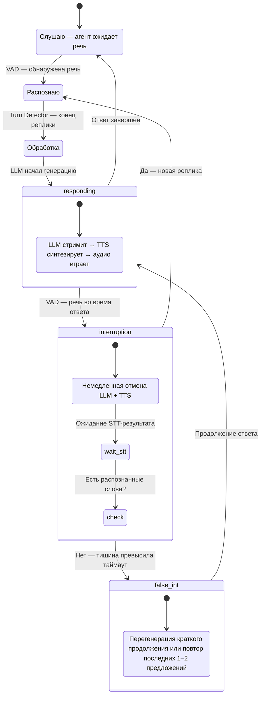
```mermaid
stateDiagram-v2
    [*] --> listening
    listening: Слушаю — агент ожидает речь

    listening --> recognizing: VAD — обнаружена речь
    recognizing: Распознаю
    recognizing --> processing: Turn Detector — конец реплики
    processing: Обработка
    processing --> responding: LLM начал генерацию

    state responding {
        [*] --> llm_tts
        llm_tts: LLM стримит → TTS синтезирует → аудио играет
    }

    responding --> interruption: VAD — речь во время ответа

    state interruption {
        [*] --> cancel
        cancel: Немедленная отмена LLM + TTS
        cancel --> wait_stt: Ожидание STT-результата
        wait_stt --> check: Есть распознанные слова?
    }

    interruption --> recognizing: Да — новая реплика
    interruption --> false_int: Нет — тишина превысила таймаут

    state false_int {
        [*] --> regen
        regen: Перегенерация краткого продолжения или повтор последних 1–2 предложений
    }

    false_int --> responding: Продолжение ответа
    responding --> listening: Ответ завершён
```

### 4.3 Проактивные реплики

После ответа запускается таймер тишины. Если пользователь не отвечает в течение порога (по умолчанию 15–20 секунд), агент инициирует продолжение:

- После короткой паузы: «Хотите, чтобы я объяснил подробнее?»
- После длинной паузы: «Если нужно время подумать — это нормально. Я здесь.»
- После обсуждения сложной темы: «Это непростая тема. Что вас больше всего беспокоит?»

Конкретные фразы генерирует LLM на основе контекста, а не хардкодятся. Таймер сбрасывается при любой активности.

```mermaid
sequenceDiagram
    participant AG as LiveKit Agent
    participant TIMER as Silence Timer
    participant LLM as LLM (LiteLLM)
    participant TTS as TTS
    participant LK as LiveKit Server
    participant PWA as PWA-клиент

    Note over AG: Агент завершил ответ

    AG->>TIMER: Запуск таймера<br/>(15-20 сек)

    alt Пользователь заговорил
        TIMER->>TIMER: Сброс таймера
    else Таймер истёк — короткая пауза (15 сек)
        TIMER->>AG: Событие: короткая пауза
        AG->>LLM: Запрос проактивной реплики<br/>Контекст + флаг "proactive"<br/>+ эмоциональное состояние
        LLM-->>AG: "Хотите, чтобы я<br/>объяснил подробнее?"
        AG->>TTS: Синтез
        TTS-->>LK: Аудио
        LK-->>PWA: Воспроизведение
        AG->>TIMER: Запуск нового таймера
    else Таймер истёк — длинная пауза (45 сек)
        TIMER->>AG: Событие: длинная пауза
        AG->>LLM: Запрос мягкой реплики<br/>Контекст + "extended_silence"
        LLM-->>AG: "Если нужно время<br/>подумать — это нормально."
        AG->>TTS: Синтез
        TTS-->>LK: Аудио
        LK-->>PWA: Воспроизведение
    end
```

### 4.4 Кризисный протокол

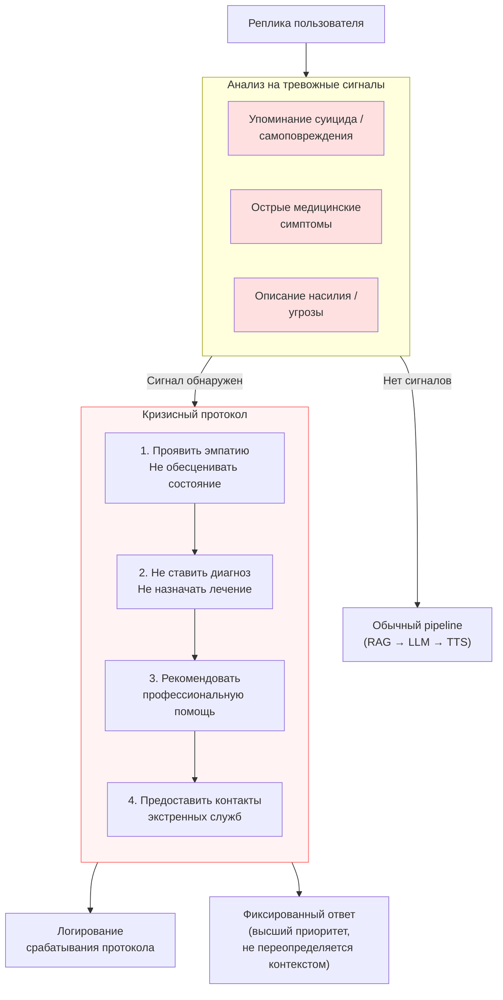
```mermaid
flowchart TD
    INPUT["Реплика пользователя"] --> ANALYSIS

    subgraph ANALYSIS["Анализ на тревожные сигналы"]
        CHECK1["Упоминание суицида /<br/>самоповреждения"]
        CHECK2["Острые медицинские<br/>симптомы"]
        CHECK3["Описание насилия /<br/>угрозы"]
    end

    ANALYSIS -->|"Сигнал обнаружен"| CRISIS_MODE
    ANALYSIS -->|"Нет сигналов"| NORMAL["Обычный pipeline<br/>(RAG → LLM → TTS)"]

    subgraph CRISIS_MODE["Кризисный протокол"]
        direction TB
        EMPATHY["1. Проявить эмпатию<br/>Не обесценивать состояние"]
        SAFETY["2. Не ставить диагноз<br/>Не назначать лечение"]
        HELP["3. Рекомендовать<br/>профессиональную помощь"]
        CONTACTS["4. Предоставить контакты<br/>экстренных служб"]
        EMPATHY --> SAFETY --> HELP --> CONTACTS
    end

    CRISIS_MODE --> LOG["Логирование<br/>срабатывания протокола"]
    CRISIS_MODE --> RESPONSE["Фиксированный ответ<br/>(высший приоритет,<br/>не переопределяется контекстом)"]

    style CRISIS_MODE fill:#fff3f3,stroke:#ff6666
    style CHECK1 fill:#ffe0e0
    style CHECK2 fill:#ffe0e0
    style CHECK3 fill:#ffe0e0
```

### 4.5 Шумоподавление

Для улучшения качества распознавания в неидеальных условиях (кафе, улица, офис) используется аудиофильтр на входе pipeline. LiveKit Agents поддерживает плагин шумоподавления. Выбор конкретного решения определяется по результатам тестирования.

---

## 5. RAG Pipeline

### 5.1 Загрузка материалов (Ingestion)

Экспертные материалы проходят пять этапов обработки:

1. **Извлечение текста** из исходных форматов: PDF, EPUB, DOCX, аудио (через транскрибацию).
2. **Семантическое чанкирование** — разбиение по смысловым блокам (абзацы, разделы), а не по фиксированному количеству токенов. Предотвращает разрыв причинно-следственных связей — важно для медицинского контента, где рекомендации и противопоказания не должны разделяться.
3. **Обогащение метаданными** — `source_type` (книга, видео, подкаст, статья, пост), `title`, `author`, `url`, `section` (глава, таймкод), `page_range`, `language`, `tags`.
4. **Генерация эмбеддингов** — через embedding-модель (варианты: OpenAI text-embedding-3-small, Cohere embed-v4, open-source через Ollama). Модель подключается через LiteLLM.
5. **Загрузка в PostgreSQL** — эмбеддинги (vector-столбец) + метаданные + HNSW-индекс для ANN-поиска.

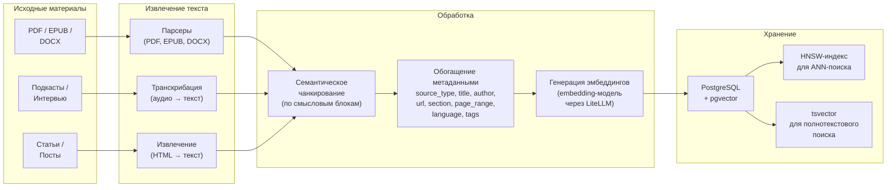
```mermaid
flowchart LR
    subgraph SOURCES["Исходные материалы"]
        PDF["PDF / EPUB /<br/>DOCX"]
        AUDIO["Подкасты /<br/>Интервью"]
        WEB["Статьи /<br/>Посты"]
    end

    subgraph EXTRACT["Извлечение текста"]
        PARSER["Парсеры<br/>(PDF, EPUB, DOCX)"]
        TRANSCRIBE["Транскрибация<br/>(аудио → текст)"]
        SCRAPER["Извлечение<br/>(HTML → текст)"]
    end

    subgraph PROCESS["Обработка"]
        CHUNK["Семантическое<br/>чанкирование<br/>(по смысловым блокам)"]
        META["Обогащение метаданными<br/>source_type, title, author,<br/>url, section, page_range,<br/>language, tags"]
        EMBED["Генерация эмбеддингов<br/>(embedding-модель<br/>через LiteLLM)"]
    end

    subgraph STORE["Хранение"]
        PG["PostgreSQL<br/>+ pgvector"]
        IDX["HNSW-индекс<br/>для ANN-поиска"]
        FTS["tsvector<br/>для полнотекстового<br/>поиска"]
    end

    PDF --> PARSER
    AUDIO --> TRANSCRIBE
    WEB --> SCRAPER

    PARSER --> CHUNK
    TRANSCRIBE --> CHUNK
    SCRAPER --> CHUNK

    CHUNK --> META --> EMBED
    EMBED --> PG
    PG --> IDX
    PG --> FTS
```

### 5.2 Поиск при запросе (Query)

При каждом обращении к LLM:

1. Текст последней реплики (или нескольких) преобразуется в эмбеддинг той же моделью.
2. PostgreSQL выполняет гибридный поиск: семантическая близость (cosine distance, pgvector) + полнотекстовый (tsvector) + фильтры по метаданным (язык, тип материала).
3. Top-K релевантных фрагментов (K = 3–5, настраивается) включаются в контекст LLM с метаданными источников.

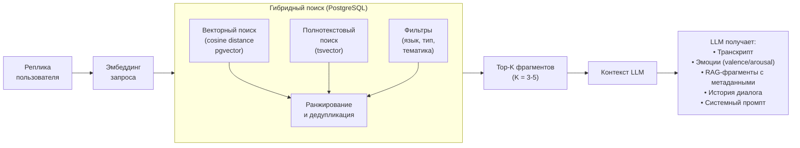
```mermaid
flowchart LR
    INPUT["Реплика<br/>пользователя"] --> Q_EMBED["Эмбеддинг<br/>запроса"]

    Q_EMBED --> SEARCH

    subgraph SEARCH["Гибридный поиск (PostgreSQL)"]
        direction TB
        VEC["Векторный поиск<br/>(cosine distance<br/>pgvector)"]
        FTS["Полнотекстовый<br/>поиск<br/>(tsvector)"]
        FILTER["Фильтры<br/>(язык, тип,<br/>тематика)"]
        RANK["Ранжирование<br/>и дедупликация"]

        VEC --> RANK
        FTS --> RANK
        FILTER --> RANK
    end

    SEARCH --> TOPK["Top-K фрагментов<br/>(K = 3-5)"]
    TOPK --> CONTEXT["Контекст LLM"]

    CONTEXT --> LLM_IN["LLM получает:<br/>• Транскрипт<br/>• Эмоции (valence/arousal)<br/>• RAG-фрагменты с метаданными<br/>• История диалога<br/>• Системный промпт"]
```

### 5.3 Атрибуция источников (от RAG до попапа)

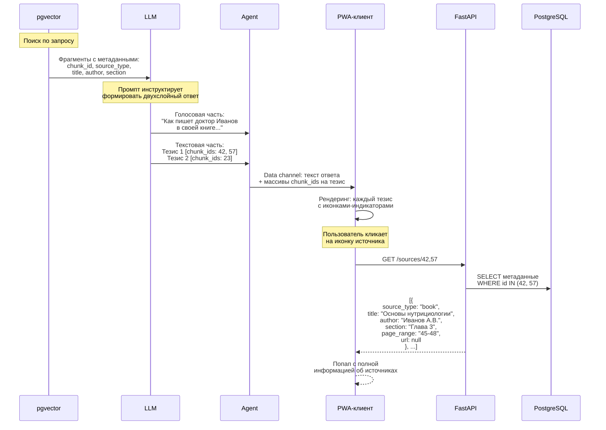
```mermaid
sequenceDiagram
    participant RAG as pgvector
    participant LLM as LLM
    participant AG as Agent
    participant PWA as PWA-клиент
    participant API as FastAPI
    participant DB as PostgreSQL

    Note over RAG: Поиск по запросу
    RAG->>LLM: Фрагменты с метаданными:<br/>chunk_id, source_type,<br/>title, author, section

    Note over LLM: Промпт инструктирует<br/>формировать двухслойный ответ

    LLM->>AG: Голосовая часть:<br/>"Как пишет доктор Иванов<br/>в своей книге..."

    LLM->>AG: Текстовая часть:<br/>Тезис 1 [chunk_ids: 42, 57]<br/>Тезис 2 [chunk_ids: 23]

    AG->>PWA: Data channel: текст ответа<br/>+ массивы chunk_ids на тезис
    PWA->>PWA: Рендеринг: каждый тезис<br/>с иконками-индикаторами

    Note over PWA: Пользователь кликает<br/>на иконку источника

    PWA->>API: GET /sources/42,57
    API->>DB: SELECT метаданные<br/>WHERE id IN (42, 57)
    API-->>PWA: [{<br/>  source_type: "book",<br/>  title: "Основы нутрициологии",<br/>  author: "Иванов А.В.",<br/>  section: "Глава 3",<br/>  page_range: "45-48",<br/>  url: null<br/>}, ...]

    PWA-->>PWA: Попап с полной<br/>информацией об источниках
```

---

## 6. Аутентификация и токены

### 6.1 Жизненный цикл JWT

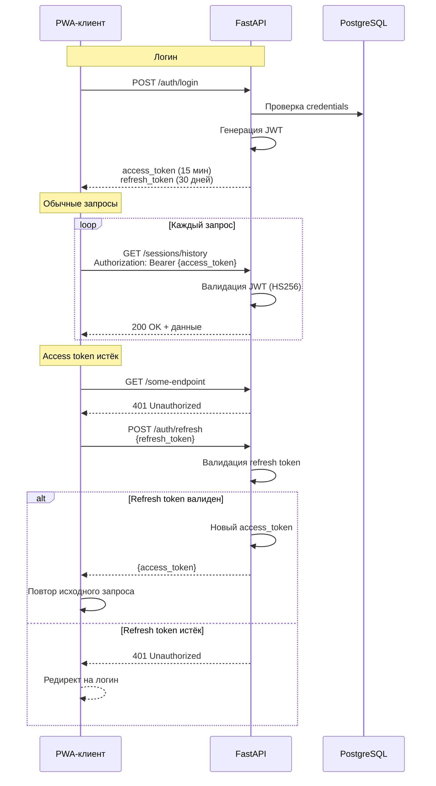
```mermaid
sequenceDiagram
    participant PWA as PWA-клиент
    participant API as FastAPI
    participant DB as PostgreSQL

    Note over PWA,API: Логин
    PWA->>API: POST /auth/login
    API->>DB: Проверка credentials
    API->>API: Генерация JWT
    API-->>PWA: access_token (15 мин)<br/>refresh_token (30 дней)

    Note over PWA: Обычные запросы
    loop Каждый запрос
        PWA->>API: GET /sessions/history<br/>Authorization: Bearer {access_token}
        API->>API: Валидация JWT (HS256)
        API-->>PWA: 200 OK + данные
    end

    Note over PWA: Access token истёк
    PWA->>API: GET /some-endpoint
    API-->>PWA: 401 Unauthorized

    PWA->>API: POST /auth/refresh<br/>{refresh_token}
    API->>API: Валидация refresh token
    alt Refresh token валиден
        API->>API: Новый access_token
        API-->>PWA: {access_token}
        PWA->>PWA: Повтор исходного запроса
    else Refresh token истёк
        API-->>PWA: 401 Unauthorized
        PWA-->>PWA: Редирект на логин
    end
```

### 6.2 Генерация LiveKit-токена

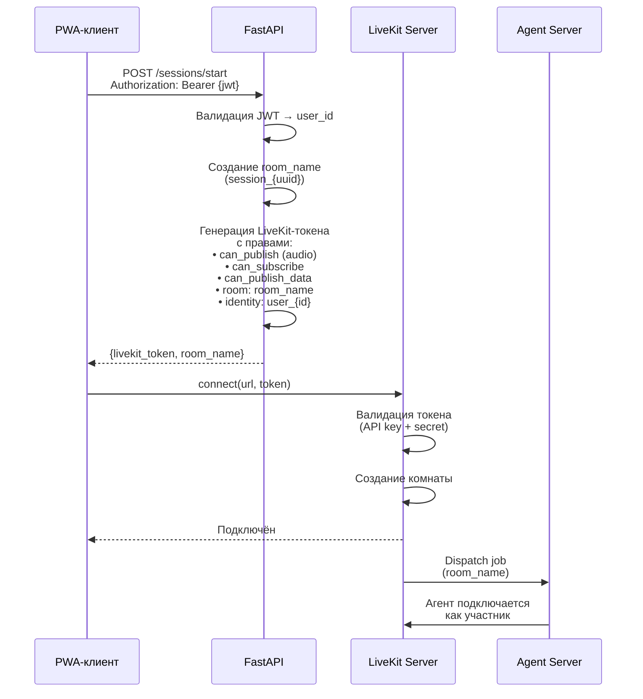
```mermaid
sequenceDiagram
    participant PWA as PWA-клиент
    participant API as FastAPI
    participant LK as LiveKit Server
    participant AG as Agent Server

    PWA->>API: POST /sessions/start<br/>Authorization: Bearer {jwt}
    API->>API: Валидация JWT → user_id
    API->>API: Создание room_name<br/>(session_{uuid})
    API->>API: Генерация LiveKit-токена<br/>с правами:<br/>• can_publish (audio)<br/>• can_subscribe<br/>• can_publish_data<br/>• room: room_name<br/>• identity: user_{id}
    API-->>PWA: {livekit_token, room_name}

    PWA->>LK: connect(url, token)
    LK->>LK: Валидация токена<br/>(API key + secret)
    LK->>LK: Создание комнаты
    LK-->>PWA: Подключён

    LK->>AG: Dispatch job<br/>(room_name)
    AG->>LK: Агент подключается<br/>как участник
```

---

## 7. Эмоциональная модель

### 7.1 Circumplex data flow

**Реализация (MVP) — гибридный подход:**

- **Быстрый сигнал** — sentiment score от Deepgram (-1..1) для каждого сегмента транскрипта. Поступает без дополнительной задержки как часть STT-результата.
- **LLM-интерпретация** — LLM инструктируется через системный промпт оценивать состояние в двумерном пространстве (valence/arousal) на основе текста, sentiment score, контекста предыдущих реплик и динамики (тренд). Не требует отдельного ML-классификатора — работает в рамках существующего LLM-вызова.

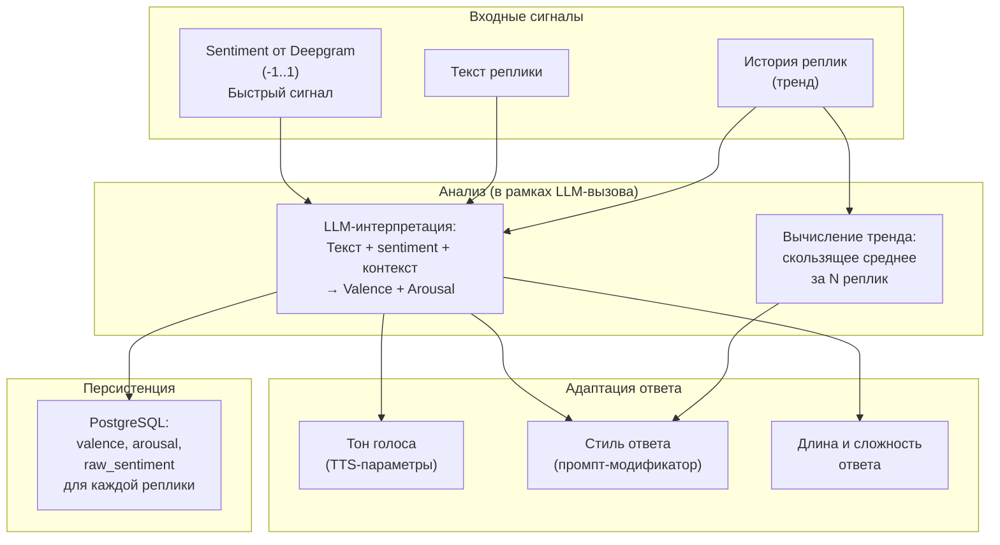
```mermaid
flowchart TB
    subgraph INPUT["Входные сигналы"]
        STT_SENT["Sentiment от Deepgram<br/>(-1..1)<br/>Быстрый сигнал"]
        TEXT["Текст реплики"]
        HISTORY["История реплик<br/>(тренд)"]
    end

    subgraph ANALYSIS["Анализ (в рамках LLM-вызова)"]
        INTERPRET["LLM-интерпретация:<br/>Текст + sentiment + контекст<br/>→ Valence + Arousal"]
        TREND["Вычисление тренда:<br/>скользящее среднее<br/>за N реплик"]
    end

    subgraph ADAPTATION["Адаптация ответа"]
        TONE["Тон голоса<br/>(TTS-параметры)"]
        STYLE["Стиль ответа<br/>(промпт-модификатор)"]
        LENGTH["Длина и сложность<br/>ответа"]
    end

    STT_SENT --> INTERPRET
    TEXT --> INTERPRET
    HISTORY --> INTERPRET
    HISTORY --> TREND

    INTERPRET --> TONE
    INTERPRET --> STYLE
    TREND --> STYLE
    INTERPRET --> LENGTH

    subgraph PERSIST["Персистенция"]
        DB["PostgreSQL:<br/>valence, arousal,<br/>raw_sentiment<br/>для каждой реплики"]
    end

    INTERPRET --> DB
```

### 7.2 Квадранты Circumplex

```mermaid
quadrantChart
    title Модель Circumplex: эмоциональные состояния
    x-axis "Негативная валентность" --> "Позитивная валентность"
    y-axis "Низкое возбуждение" --> "Высокое возбуждение"
    quadrant-1 "Энтузиазм, радость"
    quadrant-2 "Паника, тревога"
    quadrant-3 "Апатия, подавленность"
    quadrant-4 "Спокойствие, удовлетворение"
    "Паническая атака": [0.15, 0.9]
    "Тревога": [0.25, 0.75]
    "Гнев": [0.1, 0.85]
    "Грусть": [0.2, 0.3]
    "Апатия": [0.15, 0.15]
    "Скука": [0.35, 0.2]
    "Спокойствие": [0.7, 0.3]
    "Удовлетворение": [0.75, 0.4]
    "Радость": [0.8, 0.75]
    "Энтузиазм": [0.85, 0.85]
    "Интерес": [0.65, 0.65]
    "Нейтральное": [0.5, 0.5]
```

### 7.3 Трекинг эмоционального фона сессии

Помимо текущей оценки, в контексте LLM поддерживается скользящий эмоциональный фон:

- Средние значения valence/arousal за последние N реплик
- Тренд (улучшение или ухудшение)
- Моменты резких изменений

Это позволяет LLM учитывать динамику: если пользователь начал позитивно, но состояние ухудшается — агент реагирует на тренд, а не только на последнюю реплику.

---

## 8. Управление сессиями и контекстом

### Единый контекст диалога

Агрегатор контекста в LiveKit Agents автоматически собирает реплики пользователя (после STT) и ответы агента (после TTS) в единый контекстный объект. Все сообщения — текстовые и транскрибированные голосовые — хранятся в одной цепочке в формате, совместимом с OpenAI Messages API.

### Контекстное окно и история

Длина контекста ограничена размером окна LLM. Стратегии для длинных сессий:

- **Суммаризация** — старые сообщения сжимаются в краткое саммари
- **Скользящее окно** — последние N реплик + саммари предыдущих
- **Гибридный подход** — комбинация двух стратегий

Выбор конкретной стратегии — задача этапа реализации.

### Персистентность

Каждая сессия записывается в PostgreSQL:
- Полная история сообщений (текст, источник — голос или текст, временная метка)
- Эмоциональные данные для каждой реплики (valence, arousal, raw sentiment)
- Метаданные использованных RAG-фрагментов

При повторном подключении контекст предыдущих сессий может загружаться (в суммаризированном виде) для долгосрочной памяти агента.

---

## 9. Жизненный цикл агента

### 9.1 LiveKit Agent Server: job lifecycle

```mermaid
stateDiagram-v2
    [*] --> registering: Запуск контейнера agent
    registering: Регистрация в LiveKit Server
    registering --> idle: Подключение установлено
    idle: Ожидание dispatch

    idle --> job: LiveKit dispatch job (новая комната)

    state job {
        [*] --> spawn
        spawn: Отдельный Python-процесс
        spawn --> load_cfg: Загрузка промптов из PostgreSQL
        load_cfg --> connect: Подключение к комнате
        connect --> wait_user: Ожидание пользователя
        wait_user --> active: Пользователь подключён
    }

    state active {
        [*] --> pipeline
        pipeline: Voice/Text Pipeline — обработка реплик, RAG, LLM, TTS
    }

    active --> cleanup: Пользователь отключился или shutdown()

    state cleanup {
        [*] --> drain
        drain: Drain pending speech (graceful)
        drain --> save
        save: Сохранение состояния сессии в PostgreSQL
        save --> disconnect
        disconnect: Отключение от комнаты
    }

    cleanup --> idle: Процесс завершён, сервер готов
    cleanup --> [*]: Сервер выключается
```

### 9.2 Graceful shutdown при деплое

```mermaid
sequenceDiagram
    participant DEPLOY as Деплой (новая версия)
    participant AS as Agent Server
    participant JOB1 as Job 1 (активная сессия)
    participant JOB2 as Job 2 (активная сессия)
    participant LK as LiveKit Server
    participant DB as PostgreSQL

    DEPLOY->>AS: SIGTERM

    Note over AS: Graceful shutdown начат

    AS->>AS: Прекращение приёма<br/>новых job'ов
    AS->>LK: Статус: draining

    par Завершение активных сессий
        AS->>JOB1: Shutdown signal
        JOB1->>JOB1: Drain pending speech
        JOB1->>DB: Сохранение состояния
        JOB1->>LK: Отключение от комнаты
        JOB1-->>AS: Завершён

    and
        AS->>JOB2: Shutdown signal
        JOB2->>JOB2: Drain pending speech
        JOB2->>DB: Сохранение состояния
        JOB2->>LK: Отключение от комнаты
        JOB2-->>AS: Завершён
    end

    Note over AS: Все job'ы завершены<br/>(или drain_timeout истёк)

    AS->>AS: Cleanup
    AS-->>DEPLOY: Процесс завершён

    DEPLOY->>DEPLOY: Запуск нового контейнера
```

---

## 10. База данных

### 10.1 ER-диаграмма

```mermaid
erDiagram
    users {
        uuid id PK
        string email UK
        string password_hash
        boolean is_verified
        string verification_code
        timestamp verification_expires_at
        jsonb preferences
        timestamp created_at
        timestamp updated_at
    }

    sessions {
        uuid id PK
        uuid user_id FK
        string room_name
        string status "active | completed | error"
        jsonb agent_config_snapshot
        timestamp started_at
        timestamp ended_at
    }

    messages {
        uuid id PK
        uuid session_id FK
        string role "user | assistant"
        string mode "voice | text"
        text content
        text voice_transcript "если голос"
        float sentiment_raw "от Deepgram"
        float valence
        float arousal
        jsonb source_ids "ID RAG-фрагментов"
        timestamp created_at
    }

    knowledge_sources {
        uuid id PK
        string source_type "book | video | podcast | article | post"
        string title
        string author
        string url
        string language
        jsonb tags
        timestamp created_at
    }

    knowledge_chunks {
        uuid id PK
        uuid source_id FK
        text content
        string section "глава, раздел, таймкод"
        string page_range
        vector embedding "pgvector"
        tsvector search_vector "полнотекстовый"
        integer token_count
        timestamp created_at
    }

    agent_config {
        uuid id PK
        string key UK "system_prompt | voice_prompt | etc"
        text value
        integer version
        boolean is_active
        timestamp created_at
        timestamp updated_at
    }

    tts_config {
        uuid id PK
        string voice_id
        string model_id "inworld-tts-1.5-max"
        float expressiveness "0.0 - 1.0"
        float speed "0.5 - 2.0"
        string language
        boolean is_active
        timestamp created_at
    }

    users ||--o{ sessions : "имеет"
    sessions ||--o{ messages : "содержит"
    knowledge_sources ||--o{ knowledge_chunks : "разбит на"
```

---

## 11. Замена провайдеров

### Процесс замены STT

1. Убедиться, что новый провайдер поддерживается LiveKit Agents (нативно: Deepgram, Google, Azure, AssemblyAI, Groq и другие).
2. Добавить API-ключ в переменные окружения контейнера agent.
3. Сменить плагин в конфигурации AgentSession.

Не требует изменений: логика pipeline, контекст, LLM, TTS, RAG, БД.

Особенность: если новый STT не предоставляет sentiment-анализ (как Deepgram), быстрый эмоциональный сигнал не будет поступать. LLM-интерпретация эмоций продолжит работать на основе текста и контекста.

### Процесс замены LLM

1. Добавить API-ключ в переменные окружения контейнера litellm.
2. Обновить `litellm.yaml` (добавить/заменить запись).
3. Перезапустить контейнер litellm.

Не требует изменений: код агента, STT/TTS, pipeline, БД. Через LiteLLM можно подключить self-hosted модели (Ollama, vLLM) по локальному адресу.

### Процесс замены TTS

1. Убедиться, что провайдер поддерживается LiveKit Agents (нативно: ElevenLabs, Cartesia, Google, Azure, PlayHT, Deepgram и другие).
2. Добавить API-ключ в переменные окружения контейнера agent.
3. Сменить плагин в конфигурации AgentSession.

Не требует изменений: логика pipeline, STT, LLM, RAG, БД.

### Неподдерживаемый провайдер

Для STT/TTS: реализовать кастомный плагин, имплементирующий стандартный интерфейс LiveKit Agents. Объём — один модуль, оборачивающий API провайдера. Для LLM: добавить кастомный провайдер в LiteLLM (большинство уже поддерживаются).

```mermaid
flowchart TD
    START["Решение о замене провайдера"]

    START --> TYPE{Какой компонент?}

    TYPE -->|"STT"| STT_CHECK{"Есть нативный<br/>LiveKit-плагин?"}
    TYPE -->|"LLM"| LLM_CHECK{"Поддерживается<br/>LiteLLM?"}
    TYPE -->|"TTS"| TTS_CHECK{"Есть нативный<br/>LiveKit-плагин?"}

    STT_CHECK -->|"Да"| STT_NATIVE["1. Добавить API-ключ в .env<br/>2. Сменить плагин в AgentSession<br/>3. Перезапустить контейнер agent"]
    STT_CHECK -->|"Нет"| STT_CUSTOM["1. Написать кастомный плагин<br/>(реализация STT-интерфейса)<br/>2. Добавить API-ключ в .env<br/>3. Перезапустить контейнер agent"]

    LLM_CHECK -->|"Да"| LLM_NATIVE["1. Добавить API-ключ в .env<br/>2. Обновить litellm.yaml<br/>3. Перезапустить контейнер litellm"]
    LLM_CHECK -->|"Нет, OpenAI-совместим"| LLM_COMPAT["1. Указать base_url + ключ<br/>в litellm.yaml<br/>2. Перезапустить контейнер litellm"]
    LLM_CHECK -->|"Нет, несовместим"| LLM_CUSTOM["1. Написать кастомный провайдер<br/>для LiteLLM<br/>2. Обновить litellm.yaml<br/>3. Перезапустить контейнер litellm"]

    TTS_CHECK -->|"Да"| TTS_NATIVE["1. Добавить API-ключ в .env<br/>2. Сменить плагин в AgentSession<br/>3. Перезапустить контейнер agent"]
    TTS_CHECK -->|"Нет"| TTS_CUSTOM["1. Написать кастомный плагин<br/>(реализация TTS-интерфейса)<br/>2. Добавить API-ключ в .env<br/>3. Перезапустить контейнер agent"]

    STT_NATIVE --> VERIFY
    STT_CUSTOM --> VERIFY
    LLM_NATIVE --> VERIFY
    LLM_COMPAT --> VERIFY
    LLM_CUSTOM --> VERIFY
    TTS_NATIVE --> VERIFY
    TTS_CUSTOM --> VERIFY

    VERIFY["Проверка UX:<br/>тестирование с новым провайдером<br/>через Agents Playground"]

    style START fill:#e8f5e9
    style VERIFY fill:#fff3e0
```

---

## 12. Мониторинг и наблюдаемость

### Метрики pipeline

LiveKit Agents предоставляет встроенный сбор метрик:
- Задержка каждого этапа (STT, LLM, TTS)
- Общее время voice-to-voice
- Количество перебиваний
- Использование токенов LLM

LiveKit Server: количество активных соединений, качество медиа, потери пакетов.

### Логирование сессий

Каждая сессия логирует:
- Полную историю диалога с временными метками
- Эмоциональные данные каждой реплики (valence, arousal, raw sentiment)
- Использованные RAG-фрагменты и их релевантность
- Метрики задержки на каждом этапе
- Ошибки STT/LLM/TTS
- Срабатывания кризисного протокола

### LLM Observability (пост-MVP)

Для анализа качества ответов, корректности RAG-выборки и эмоциональной адаптации планируется подключение инструмента LLM-трейсинга (Langfuse, Phoenix или аналог). Это позволит отслеживать: какие RAG-фрагменты извлекались, насколько они были релевантны, как LLM использовал контекст, в какие моменты срабатывал кризисный протокол. LiteLLM поддерживает интеграцию с Langfuse.

### Алертинг

Необходимые алерты:
- Превышение целевой задержки voice-to-voice (более 2 секунд)
- Ошибки подключения к внешним API (STT, LLM, TTS)
- Исчерпание ресурсов VPS (CPU > 80%, RAM > 85%)
- Недоступность Docker-контейнеров
- Ошибки LiveKit Server (отказ в подключении, проблемы с TURN)

---

## 13. Масштабирование (пост-MVP)

Текущая архитектура рассчитана на десятки одновременных сессий на одном VPS. Направления роста:

### Горизонтальное масштабирование агентов

LiveKit Agent Server нативно поддерживает горизонтальное масштабирование. Несколько Agent Server подключаются к одному LiveKit Server, load balancing распределяет job'ы автоматически. Каждый агент stateless — состояние в PostgreSQL. Docker Compose может быть заменён на Docker Swarm или Kubernetes.

### Кластеризация LiveKit

LiveKit Server поддерживает кластерный режим с несколькими нодами. При необходимости — переход на LiveKit Cloud для управляемого масштабирования.

### Self-hosted STT/TTS

Для снижения стоимости или улучшения приватности:
- **STT:** Faster-Whisper на GPU-ноде
- **TTS:** XTTS v2 или Kokoro на GPU-ноде

Замена — смена плагина в конфигурации AgentSession.

### Self-hosted LLM

Через LiteLLM подключается Ollama, vLLM или аналог. Требует GPU (NVIDIA RTX 4090 24 GB или аналог). Код агента не затрагивается.

### Мульти-агентная архитектура

Добавление агентов разных специализаций через explicit dispatch в LiveKit Agent Server. Агенты регистрируются под разными `agent_name` и диспатчатся по типу запроса.
